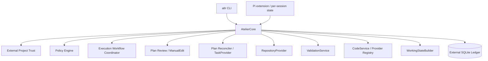
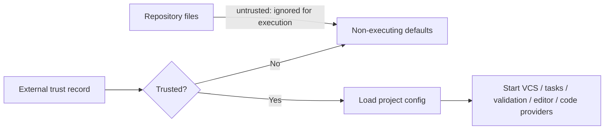
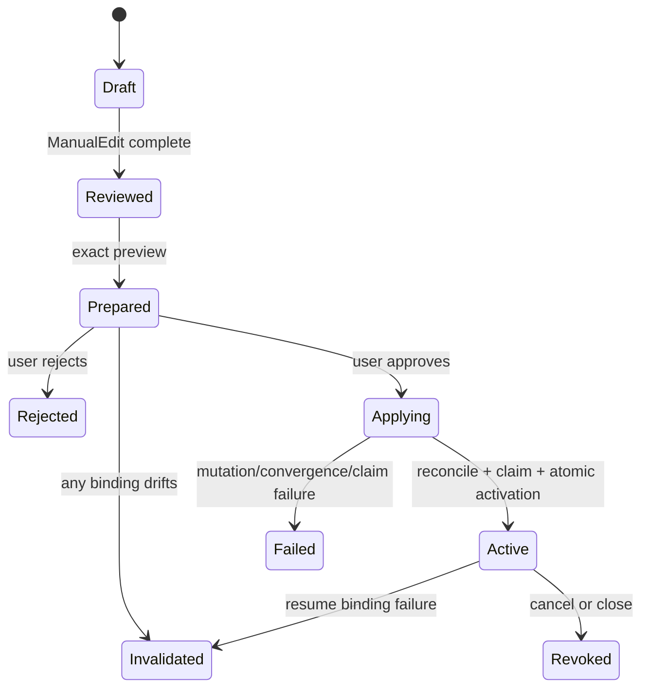
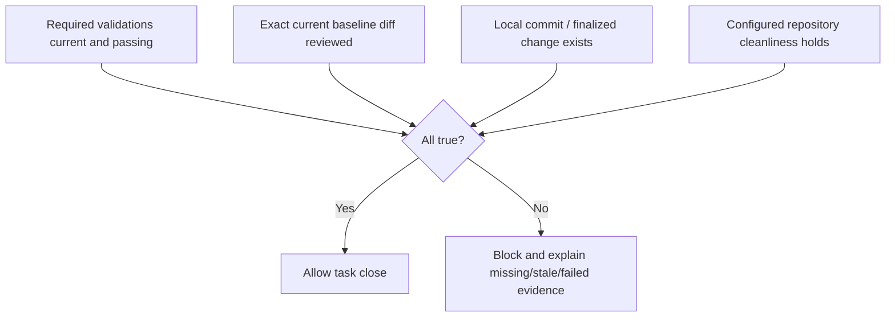

# Atelier Architecture — 0.14.0-alpha.5

## Product boundary

Atelier is a local-first workflow control plane for an Agentic Development Environment. The CLI is
`atlr`; Pi is the current interactive host. Atelier owns project trust, reviewed-plan execution,
authorization, task reconciliation, durable evidence, validation closure, Working State, and normalized
code-provider orchestration.

External tools retain their native ownership:

- editors own interactive text editing;
- Jujutsu is the primary repository model and Git is the compatibility provider;
- Beads or another `TaskProvider` owns task storage;
- codesearch and Octocode own indexing and retrieval implementation;
- configured commands own validation behavior;
- the operating system owns process isolation. Atelier does not currently provide a shell sandbox.

## Runtime topology



There is no daemon or transport boundary in this release. Core is an in-process TypeScript runtime used
by the CLI and Pi extension.

## Trust boundary

Trust is decided before repository-owned configuration is loaded. The record is stored in the user state
directory, outside the project.



Before trust:

- repository `config.json` does not override executable commands;
- validation, editor, task, VCS, and code-provider commands do not start;
- Pi does not start background indexing;
- `doctor` remains observational and does not open SQLite;
- runtime state remains outside the repository and is not redirected by project configuration.

Additional multi-repository roots require separate external approval.

See ADR-0024.

## Project data and runtime data

Trackable project documents:

```text
.atelier/config.json
.atelier/PLAN.md
.atelier/validation.json
.atelier/workspace.json
```

User-owned runtime state:

```text
${ATLR_STATE_HOME:-${XDG_STATE_HOME:-~/.local/state}}/
  atelier/repositories/<canonical-root-hash>/atelier.db
```

The runtime database contains approvals, execution and permission grants, task mappings, tool evidence,
validation evidence, retrieval evidence, workflow checkpoints, and Working State inputs.

## Exact approval transaction

Preparation records:

- exact reviewed plan hash;
- task-provider identity and version;
- deterministic reconciliation digest and operation set;
- primary repository snapshot;
- revision bindings for every approved workspace root;
- retrieval provider/index revision bindings;
- exact typed capability bundle and digest.

Approval reparses and recomputes all of those values immediately before mutation. Rejection performs no
provider mutation. Acceptance applies reconciliation, verifies convergence, claims one approved-plan
task, then atomically stores:

- accepted plan approval;
- applied reconciliation transaction;
- active execution grant;
- typed task-capability grants;
- workflow mode and current task state.



Legacy execution records without the exact capability bundle fail closed. See ADR-0019 and ADR-0025.

## Authorization

The permission boundary is effect- and execution-aware:

```text
typed       Atelier knows the operation and resolves/checks its paths
sandboxed   reserved for a future verifiable process sandbox
unconfined  generic shell or process execution
```

Exact plan approval mints only a narrow task capability bundle. Typed file operations must remain inside
the approved root after real-path resolution, including nearest-existing-ancestor checks for new files.
Task, validation, and repository operations must match the active execution and repository identity.

Generic shell is always unconfined in this release. It does not inherit typed task capabilities and
requires a one-operation grant. The shell classifier provides effect/risk information, not a security
proof of repository confinement.

Supported grant lifecycles are `operation`, `task`, and `repository`. Operation grants are consumed at
authorization attempt. Task grants are bound to an active execution. Legacy `turn` and `session` grants
are revoked by migration.

## Repository authority and source baselines

Each repository provider returns explicit status and a revision-aware snapshot. Failures throw
`RepositoryObservationError`; they never become an empty change list.

Git snapshots and evidence include tracked, staged, unstaged, and untracked source state as appropriate.
Jujutsu snapshots use repository, workspace, change, commit, and source-content state while excluding
irrelevant operation-log churn from source freshness.

Exact approval binds every workspace root independently. Primary source drift can represent the approved
task’s own work when the baseline remains reachable. Secondary-root drift invalidates execution because
Atelier cannot attribute it to the active primary task. See ADR-0027.

## Tool execution evidence

Pi performs blocking authorization before a mutating typed tool. Atelier stores:

- policy decision and matched grant;
- active task/execution identity;
- before repository snapshot;
- started, succeeded, failed, or interrupted outcome;
- after snapshot and observed changed paths;
- bounded error details.

One-operation grants are consumed at authorization, not after success. Pending evidence is marked
interrupted during shutdown/recovery.

## Validation and completion

Validation commands execute as argument arrays with `shell: false`, bounded and redacted output,
abort-aware process-group termination, a sanitized environment, and repository/environment fingerprints.

Task completion uses one authoritative predicate:



If validation is required, at least one applicable check must be `required: true`. The removed
validation `approval` field is rejected. Final-diff review is hash-bound; a changed diff must be previewed
and reviewed again. See ADR-0026.

## Working State

Working State is deterministic reconstruction from durable sources:

- trust and workflow mode;
- reviewed plan and exact approval;
- reconciliation and active execution;
- current task, approved-plan ready tasks, dependencies, and blockers;
- active capabilities and one-operation grants;
- mutation and validation evidence;
- repository snapshots and closure readiness;
- bounded code evidence with provenance and freshness;
- corrections, findings, decisions, omissions, and next action.

Conversation text and model compaction are not authorities. Pi receives reconstructed Working State at
agent start and before compaction. Compaction still exists in this release, but its summary is seeded from
durable state rather than treated as the source of truth.

## Code intelligence

Atelier owns provider contracts, capability negotiation, budgets, normalized references, provenance,
revision bindings, deduplication, reuse, and invalidation. Providers own indexes.

```text
CodeService
  ├── codesearch (default)
  ├── Octocode (optional)
  ├── mock (tests)
  └── disabled
```

Provider-first retrieval is advisory. Pi activates provider tools and records fallback/degradation, but
retrieval economy does not deny otherwise authorized inspection. Evidence is isolated by provider,
workspace, repository scope, source revision, and index revision.

## Session lifecycle

Each Pi session owns its own Core, root, plan-review state, retrieval session, and index coordinator.
Session replacement and shutdown await asynchronous provider disposal before SQLite closes. This avoids
cross-session state replacement and late MCP callbacks against a closed ledger.

## Build and conformance

Stable JavaScript and declarations are emitted through `tsconfig.build.json`. The package and launcher
consume `dist`; TypeScript source launchers are development-only.

Deterministic CI runs the pinned Node/lockfile gate. Live Jujutsu, codesearch, Beads, and Pi/Bun checks are
separate manually dispatched conformance jobs so fixture evidence cannot be confused with live results.
