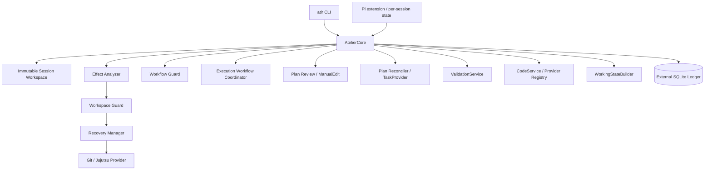
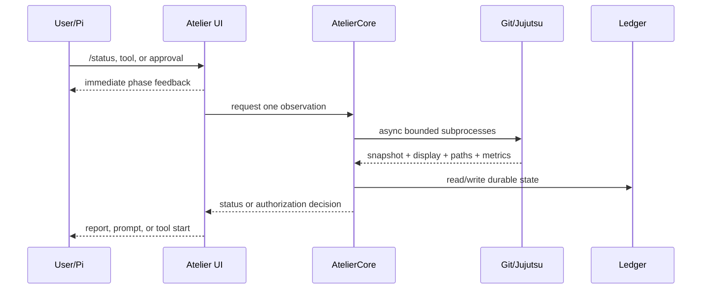
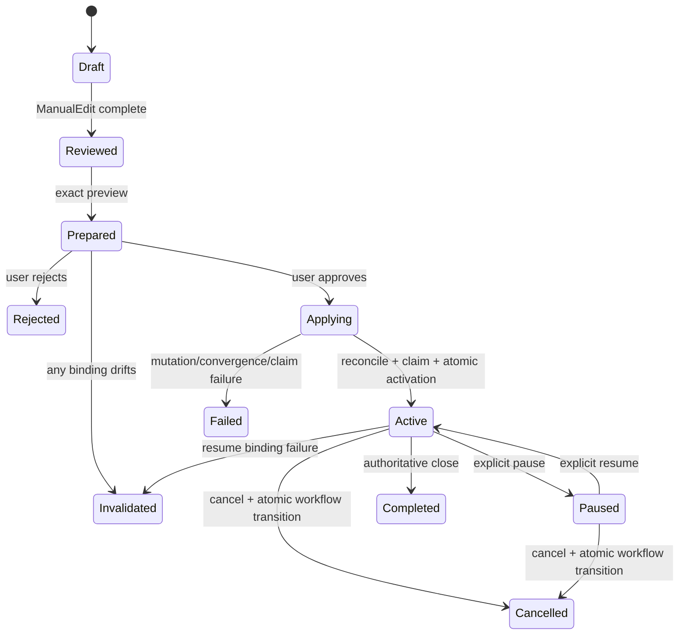
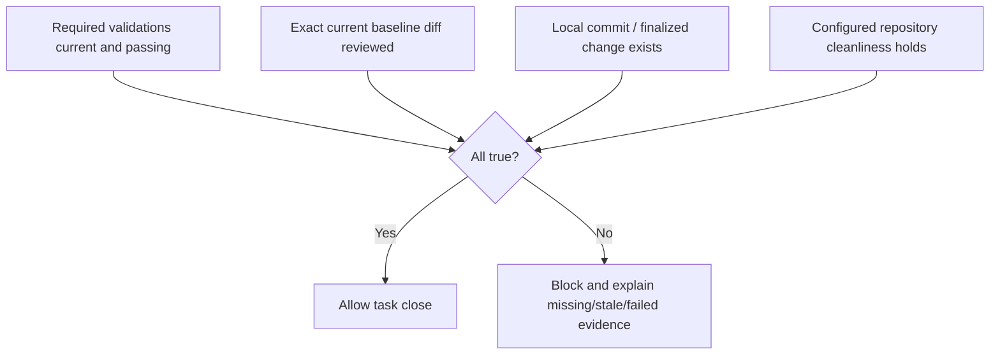

# Atelier Architecture — 0.14.0-alpha.32

The Pi integration owns a session-local `FooterStatusController` and request-scoped observation pipeline. It
serializes and coalesces status observations, consumes model/thinking and code-index events, invalidates cached
Git/Jujutsu state at mutation boundaries, and compares current source revisions with the indexed baseline before
rendering intelligence readiness. It does not poll while Pi is idle; the next Pi interaction refreshes externally
changed state.

Alpha.32 centralizes path identity in `security/path-boundary.ts` and `repository/repository-path.ts`. Every
repository-aware subsystem receives three deliberate spellings: the caller-facing lexical key, the canonical
filesystem entry with parent aliases resolved, and the fully resolved access target. Repository roots, caches,
workspace membership, and boundary checks use canonical identities; Git/Jujutsu pathspecs, reviewed task scope,
and recovery snapshots preserve the named final entry. This prevents macOS `/var` versus `/private/var` drift
without conflating a tracked symlink with the file it targets. Missing descendants are resolved through the
nearest existing canonical ancestor, so planned new paths and existing paths share one identity model.

Each repository provider also versions its observation cache: invalidation detaches any in-flight result so a
slower pre-mutation observation cannot overwrite newer footer, workflow, or code-intelligence state.

## Product boundary

Atelier is a local-first workflow control plane for an Agentic Development Environment. The CLI is
`atlr`; Pi is the current interactive host. Atelier owns immutable session-workspace policy, reviewed-plan
execution, task reconciliation, exact recovery checkpoints, durable evidence, validation closure, Working
State, and normalized code-provider orchestration.

External tools retain their native ownership:

- editors own interactive text editing;
- Jujutsu is the primary repository model and Git is the compatibility provider;
- Beads or another `TaskProvider` owns task storage;
- codesearch and Octocode own indexing and retrieval implementation;
- configured commands own validation behavior;
- macOS Seatbelt or Linux Bubblewrap provides the available OS shell boundary.

## Runtime topology



The session workspace is captured from the canonical startup directory, or from one explicit
`--workspace` override, before later directory changes. It is immutable for that process. A repository may
occupy a subdirectory of the workspace; Atelier never silently expands the workspace to a VCS root.

## Pi trust independence

Pi `/trust` controls loading Pi-owned project resources. Atelier does not register a trust command, persist
trusted-project records, or derive filesystem authority from Pi trust. Repository configuration is read as
ordinary workspace data; its subprocesses receive a minimal environment and remain subject to the same
workspace, recovery, secret, privilege, and sandbox constraints as other operations.

## Pi footer presentation

Atelier owns a responsive two-row footer when `footer` is `atelier`. The first row presents
`Atelier: <model> · <thinking-level> · ctx <percent>` on the left and the workflow mode plus an adaptive
task title or Beads ID on the right. The second row presents provider-native `jj:` or `git:` identity and
clean/dirty/conflicted state on the left, with `intel:` health on the right. Theme bold and semantic colors
are applied by state, and expected empty workflow fields are deliberately omitted. `status-only` and
`disabled` release custom-footer ownership back to Pi.

## Interactive observation pipeline

Routine Pi interactions use an asynchronous `RepositoryObservation` rather than assembling repository facts
through independent synchronous calls. One observation can contain revision identity, display state, changed
paths, batched path classifications, optional file inventory, and metrics for subprocesses and content hashing.
`/status`, permission evaluation, exact approval, recovery preparation, and execution-evidence start reuse the
same observation when they belong to one user action.

Repository roots, provider selection, Beads version/initialization state, recent task records, and provider
readiness are cached with explicit mutation invalidation. Dirty-source identity hashes only changed and untracked
source paths. Presentation does not run the full closure predicate repeatedly: passive status consumes cached
closure evidence, while closure itself and `/workflow full` remain authoritative.

The interactive sequence is:



`/performance` exposes bounded session-local phase summaries, including duration, subprocess counts, files and
bytes hashed, cache hits/misses, and SQLite operation/lock-wait observations. The telemetry contains no raw
provider output or secret material.

## Persistent Pi report presentation

Atelier registers a custom TUI-only session-entry renderer for structured slash-command output. `/status`,
`/workflow` (`/state` remains a compatibility alias), `/ready`, code-intelligence commands, `/changed`,
`/validate`, and `/evidence` append expandable report cards that remain in transcript scrollback but do not
participate in LLM context. Each card renders a divider and compact `➤` summary while collapsed; Pi's global
entry expansion state changes it to `▼` and reveals the Markdown body. Sparse reports use bold field/value
lines, while dense result sets use tables or grouped sections. Transient notifications remain reserved for
short warnings and lifecycle events.

A workspace with no configured code provider is presented as `intel: disabled`, a neutral configuration
state. `offline` is reserved for a configured provider that cannot be reached or has failed. Footer thinking
levels use normal foreground contrast rather than dim text.

## Project data and runtime data

Trackable project documents:

```text
.atelier/config.json
.atelier/PLAN.md
.atelier/validation.json
.atelier/workspace.json
```

User-owned runtime state:

```text
${ATLR_STATE_HOME:-${XDG_STATE_HOME:-~/.local/state}}/
  atelier/repositories/<canonical-root-hash>/atelier.db
  atelier/repositories/<canonical-root-hash>/checkpoints/<checkpoint-id>/
```

The runtime database contains plan approvals, execution grants, task mappings, tool evidence, validation
evidence, retrieval evidence, workflow checkpoints, and Working State inputs. It contains no active
filesystem permission-grant table. A migration drops obsolete `permission_grants` storage rather than
reinterpreting old records.

## Exact approval transaction

Preparation records:

- exact reviewed plan hash;
- task-provider identity and version;
- deterministic reconciliation digest and operation set;
- primary repository snapshot;
- revision bindings for every workspace repository;
- retrieval provider/index revision bindings;
- reviewed task constraints and their digest.

Approval reparses and recomputes all values immediately before mutation. Rejection performs no provider
mutation. Acceptance applies reconciliation, verifies convergence, claims one reviewed-plan task, then
atomically stores the accepted plan approval, reconciliation transaction, active execution grant, reviewed
task constraints, workflow mode, and current task. Approval does not start an agent turn.



## Workflow constraints and filesystem policy

The workflow guard and workspace evaluator are deliberately separate:

- **Workflow guard:** enforces investigate/plan/act mode, active-task identity, reviewed source paths,
  named validations, local-change scope, pause state, and task-closure readiness.
- **Workspace evaluator:** decides whether concrete effects are inside the immutable workspace, protected
  as likely secrets, privileged, read-only, or exactly recoverable.

The evaluator returns `allow`, `checkpoint_then_allow`, `ask`, or `deny`. Clean tracked changes are
recoverable directly from VCS. Dirty tracked destruction and practical untracked/ignored destruction use a
verified checkpoint. Outside-workspace access, likely-secret access, privilege escalation, indeterminate
destructive path sets, and failed or unsuitable checkpoints ask once for the concrete consequence.

The effect analyzer resolves structured read/write/edit calls precisely and parses straightforward shell
commands, redirections, chains, pipelines, file replacements, VCS restores, and common inspection
commands. It does not decide policy. Unknown interpreter/build/script effects remain conservative.

## Exact recovery

`RecoveryManager` copies affected untracked/ignored contents and captures provider-native state before a
destructive operation:

- Git stores the exact index entries and flags plus scoped porcelain state, preserving staged,
  unstaged, partially staged, mode, rename, symlink, ignored, and affected untracked state without
  changing branch history or silently staging user work.
- Jujutsu snapshots the working copy and captures the native operation-log identity, then restores and
  verifies that operation when recovery is requested.

File copies preserve regular-file contents and modes, directories where practical, normal and broken
symlinks, and missing-path state. Size and unsuitable-directory limits fail atomically. Every checkpoint
records its Pi session, tool call, affected paths, provider state, verification result, and explicit restore
command.

## Shell execution

Pi's model-facing `bash` replacement and direct `user_bash` event both pass through the same effect and
workspace evaluation. A matching pre-execution authorization token is required before the executor runs.
When available, Seatbelt or Bubblewrap grants one writable workspace, hides common credential paths,
uses a minimal environment, disables network by default, and enforces process timeouts. When no sandbox
backend exists, execution can fall back only after the concrete effects were allowed, checkpointed, or
approved. Sandbox confinement alone does not make unknown destructive effects recoverable.

## Repository authority and source baselines

Each repository provider returns explicit status and a revision-aware snapshot. Failures throw
`RepositoryObservationError`; they never become an empty change list.

Git and Jujutsu snapshots carry two related identities. Raw VCS fields retain commit/change/operation
details for diagnostics and recovery. A separate source base plus source-content fingerprint excludes
`.atelier`, Beads, provider indexes, and other workflow metadata. Approval, retrieval, validation, and
execution freshness use the source identity rather than raw metadata churn.

Exact approval binds every workspace root independently. Primary source drift can represent the approved
task’s own work when the baseline remains reachable. Secondary-root drift invalidates execution because
Atelier cannot attribute it to the active primary task. See ADR-0027.

## Tool execution evidence

Pi performs blocking authorization before a mutating typed tool. Atelier stores:

- policy decision and matched grant;
- active task/execution identity;
- before repository snapshot;
- started, succeeded, failed, or interrupted outcome;
- after snapshot and the path/content delta attributable to that operation, separate from paths already
  dirty before it started;
- bounded error details.

One-operation grants are consumed at authorization, not after success. Pending evidence is marked
interrupted during shutdown/recovery. Runtime interruption is derived from structured abort state or an
exact tool-owned abort sentinel; arbitrary error text cannot turn a normal failure into interruption.

## Validation and completion

Validation commands execute as argument arrays with `shell: false`, bounded and redacted output,
abort-aware process-group termination, a sanitized environment, and repository/environment fingerprints.
Pi exposes the same boundary to the model through typed `atlr_validate`; declared checks never require a
Bash substitution.

Task completion uses one authoritative predicate:



If validation is required, at least one applicable check must be `required: true`. Readiness separately
reports a missing focused selection, a no-match selection, or missing required configuration. The removed
validation `approval` field is rejected. Final-diff review is hash-bound; a changed diff must be previewed
and reviewed again.

The predicate blocks task closure, not user control. An incomplete task may remain active and idle.
`agent_settled` emits at most one passive notice and never schedules a follow-up model turn.
`/atelier-stop` ends only the current turn; `/atelier-pause` durably disables agent mutation;
`/atelier-resume` restores the active execution; `/cancel` atomically revokes the grant and workflow
without waiting for idle. See ADR-0026, ADR-0028, and ADR-0029.

## Working State

Working State is deterministic reconstruction from durable sources:

- immutable session workspace and workflow mode;
- reviewed plan and exact approval;
- reconciliation and active execution;
- current task, approved-plan ready tasks, dependencies, and blockers;
- reviewed task constraints and recovery checkpoints;
- mutation and validation evidence;
- repository snapshots and closure readiness;
- bounded code evidence with provenance and freshness;
- corrections, findings, decisions, omissions, and next action.

Conversation text and model compaction are not authorities. Pi receives reconstructed Working State at
agent start and before compaction. Compaction still exists in this release, but its summary is seeded from
durable state rather than treated as the source of truth.

## Code intelligence

Atelier owns provider contracts, capability negotiation, budgets, normalized references, provenance,
revision bindings, deduplication, reuse, and invalidation. Providers own indexes.

```text
CodeService
  ├── codesearch (default)
  ├── Octocode (optional)
  ├── mock (tests)
  └── disabled
```

Provider-first retrieval is advisory. Pi activates provider tools and records fallback/degradation, but
retrieval economy does not deny otherwise authorized inspection. Evidence is isolated by provider,
workspace, repository scope, source revision, and index revision.

## Session lifecycle

Each Pi session owns its own Core, root, plan-review state, retrieval session, and index coordinator.
Session replacement and shutdown await asynchronous provider disposal before SQLite closes. This avoids
cross-session state replacement and late MCP callbacks against a closed ledger.

## Build and conformance

Stable JavaScript and declarations are emitted through `tsconfig.build.json`. The package and launcher
consume `dist`; TypeScript source launchers are development-only.

Deterministic CI runs the pinned Node/lockfile gate. Live Jujutsu, codesearch, Beads, and Pi/Bun checks are
separate manually dispatched conformance jobs so fixture evidence cannot be confused with live results.
