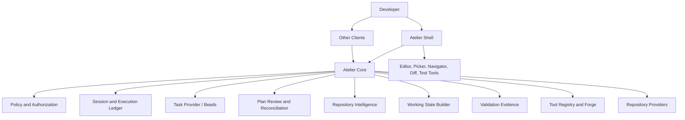
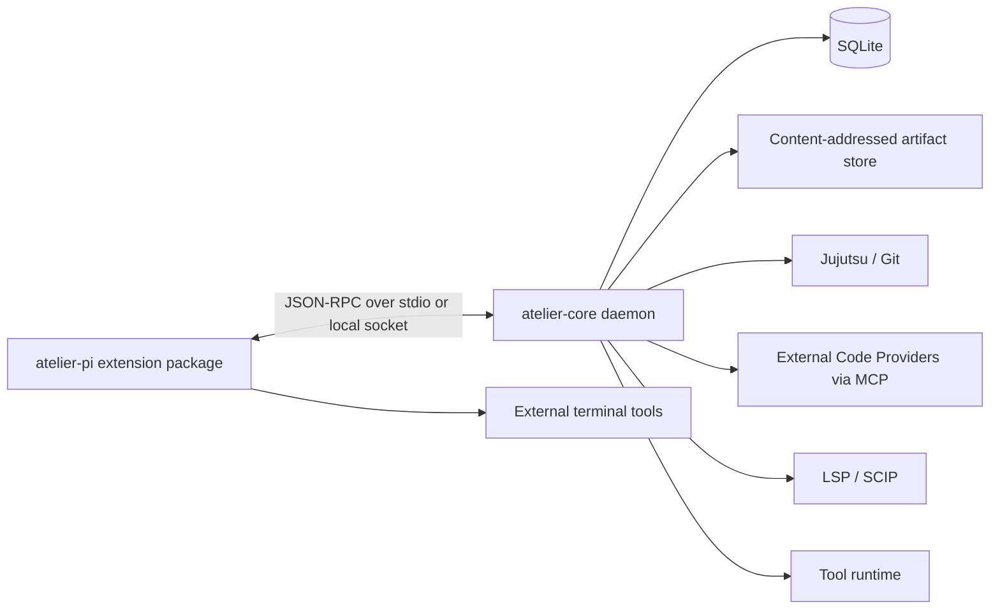
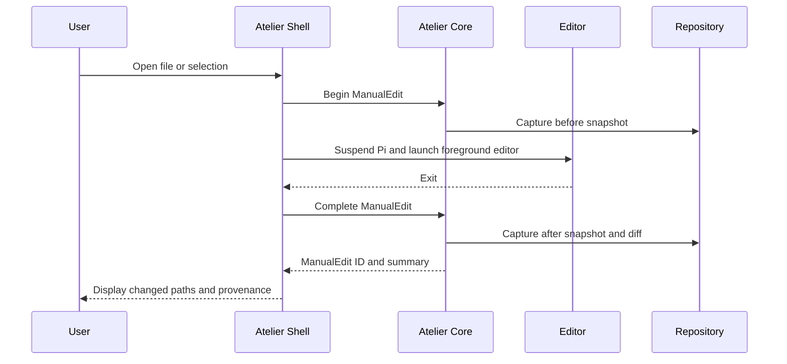
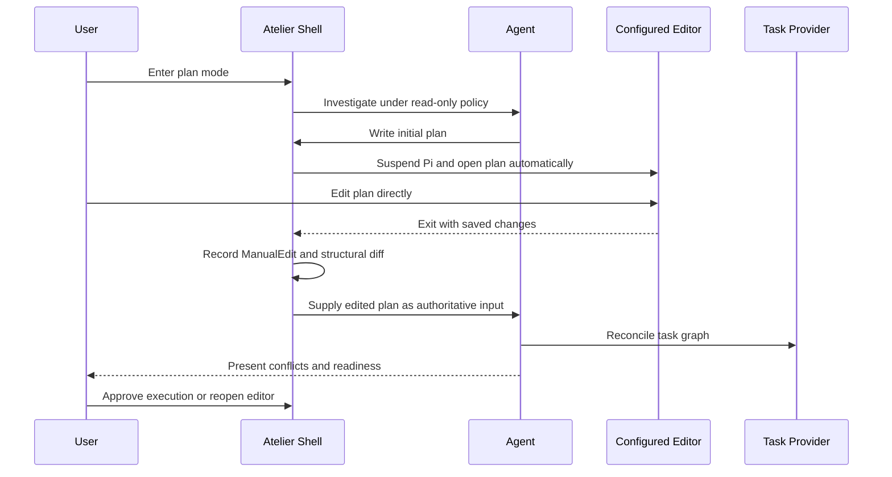
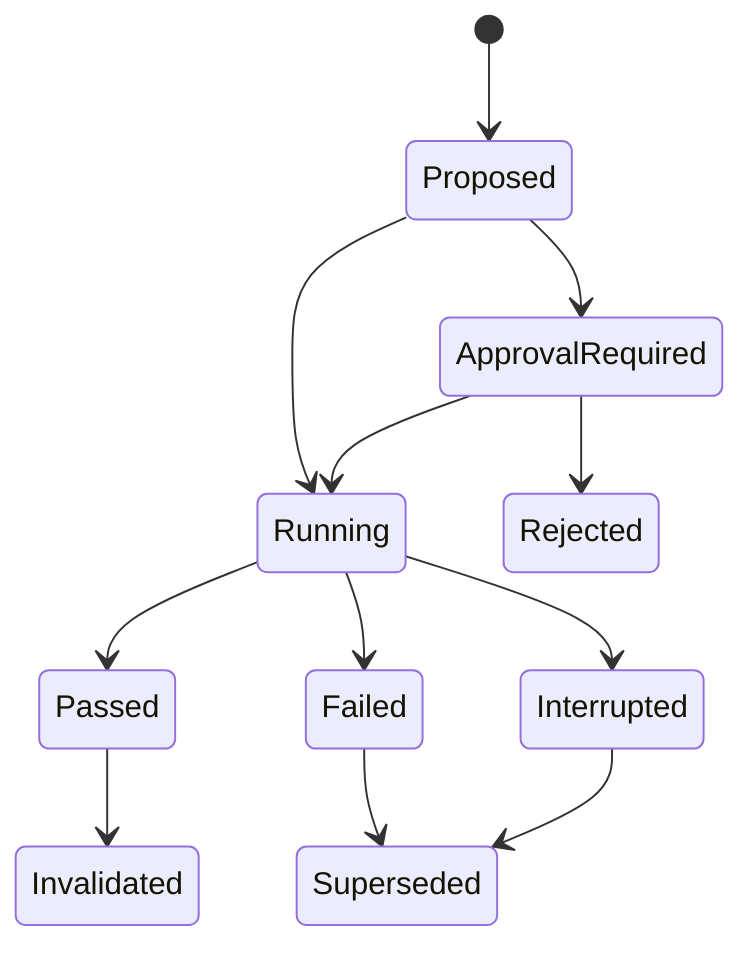

> **v0.8.9 retrieval policy:** The external provider remains authoritative for semantic and literal retrieval. Atelier now augments healthy semantic results only with exact identifier hints or code-shaped query tokens, balances mixed source/test evidence, preserves provider rank, and reserves broad literal extraction for degraded fallback. See ADR-0010.

> **v0.5.0 architectural correction:** Atelier no longer owns a native source, FTS5, Tree-sitter, embedding, vector, or code-graph implementation by default. The accepted design is external provider integration behind the Atelier-owned CodeProvider contract. `codesearch` is the first planned provider and Octocode the second experimental provider. See `CODE_INTELLIGENCE.md` and ADR-0002.

# Atelier — Agentic Development Environment Implementation Plan

## Implementation Status — v0.2.0

The current prototype implements the guarded shell vertical slice plus two repository-aware foundations:

- Incremental SQLite FTS5 indexing for tracked and untracked text files.
- Snapshot-qualified search with stale-result reporting.
- Validation manifests, direct command execution, and durable evidence.
- Working State projection of repository and validation evidence.
- Matching `atlr` CLI and concise Pi slash commands for index, search, validate, and evidence.

Tree-sitter symbols, semantic indexing, focused-validation selection, and reusable validation policies remain planned work.

---

## 1. Executive Summary

Atelier should be built as a local-first development operating environment composed of two cooperating systems:

1. **Atelier Core** — a harness-independent repository intelligence, Working State construction, execution evidence, and tool lifecycle service.
2. **Atelier Shell** — a terminal-native, Pi-based user experience that enforces permissions, coordinates agent activity, invokes external development tools, and records provenance.

This separation resolves the main tension in the source material:

- The Pi-oriented ideas require tight control over terminal interaction, permissions, manual edits, validation, and Jujutsu workflows.
- The reusable-tools ideas require a persistent intelligence service usable by Pi, other harnesses, editors, and future clients.

The initial product should therefore not be a monolithic new IDE, a Pi fork, or a complete multi-agent operating system. It should be a thin Pi shell over a durable local service, with typed APIs between them.

The implementation order should prioritize enforceable safety and repository correctness before advanced retrieval or generated tools:

```text
Policy and provenance
        ↓
Repository identity and execution ledger
        ↓
Lexical and syntax intelligence
        ↓
Deterministic Working State construction
        ↓
Validation evidence
        ↓
Semantic intelligence
        ↓
Tool discovery and forging
        ↓
Additional clients and parallel agents
```

---


## 2. Project Identity and Naming

### 2.1 Product and category

**Atelier** is the project and product name. Atelier is an **Agentic Development Environment (ADE)**. ADE is the product category, analogous to IDE, and must not be used as the product name, executable name, package prefix, state-directory name, or task-ID prefix.

- Product: **Atelier**
- CLI executable: **`atlr`**
- Pi slash commands use the same verb as the CLI subcommand without a product prefix.
- Repository state directory: **`.atelier/`**
- User configuration directory: **`~/.config/atelier/`**
- Project task prefix: **`ATLR-`**

Atelier shares a restrained theme with Maison: Maison prepares and maintains the development home; Atelier is the workshop where software is planned, implemented, reviewed, and validated. This metaphor is branding, not a replacement vocabulary for software engineering concepts.

### 2.2 Naming paradigm

Use short, recognizable engineering terms in the CLI, APIs, schemas, and documentation:

```text
Plan
Task
Working State
Tool
Evidence
Validation
Repository
Workspace
Permission
Policy
```

Do not introduce thematic substitutes such as Blueprint, Commission, Bench, Inspection, or Shop Notes unless a future usability study demonstrates that they improve clarity.

**Working State** is the authoritative reconstructed execution state used to resume and guide work. It combines current task state, the approved plan, repository state, permissions, manual edits, evidence, validation state, and a bounded recent-conversation tail. The model input is a projection of Working State; the prompt and conversation are not sources of truth.

### 2.3 Provenance terminology

Provenance describes how a modification occurred, not whether a human or model performed it. The canonical classes are:

```text
Manual Edited
Agent Edited
Formatter Edited
Generated
Imported
```

Any content the user can modify directly through an editor or another non-agent path is recorded as **Manual Edited** through a `ManualEdit` transaction. Person-based provenance labels are prohibited in product language, schemas, code, and documentation.

### 2.4 Command naming

The CLI and Pi command surfaces use the same command verbs:

```text
atlr status     /status
atlr plan       /plan
atlr review     /review
atlr approve    /approve
atlr ready      /ready
atlr state      /state
```

The CLI uses spaces for command hierarchy. Pi uses hyphens because slash-command names are single tokens. The semantic verb must remain identical across both interfaces.

---

## 3. Product Definition

### 3.1 Purpose

Atelier is a terminal-native, agent-first development environment that makes repository state, user intent, permissions, provenance, Working State retrieval, validation, and reusable tools explicit and machine-enforceable.

It treats the agent session as the primary interaction surface. Editors, file navigators, fuzzy finders, diff viewers, repository tools, and test runners remain specialized external tools invoked through narrow adapters.

### 3.2 Primary problems

Atelier addresses these failures in current coding harnesses:

- Treating a defect report, log, file path, or review comment as permission to modify code.
- Creating branches, worktrees, tasks, commits, pushes, or dependencies without explicit approval.
- Repeating expensive validation after equivalent evidence already exists.
- Losing or distorting instructions through LLM-generated conversation compaction.
- Reverting or overwriting manual edits because their provenance is unknown.
- Repeatedly exploring a repository with grep and file reads instead of retaining structured intelligence.
- Generating duplicate ad hoc tools rather than discovering and reusing durable tools.
- Coupling useful repository intelligence to one agent harness.
- Using Git dirty-tree and staging concepts as the primary model for local agent work when Jujutsu offers better operation history and recovery.

### 3.3 Long-term vision

Atelier becomes a local repository operating environment with several interchangeable clients:



### 3.4 Design principles

1. **Enforce important rules in runtime code, not prompts.**
2. **Use explicit state where inference could cause mutation or data loss.**
3. **Treat manual, agent, formatter, and repository changes as distinct provenance.**
4. **Compose mature command-line tools instead of rebuilding them.**
5. **Maintain deterministic bounded Working State and retrieve historical evidence by identifier.**
6. **Use hybrid repository intelligence; no single index is authoritative for every query.**
7. **Prefer read-only tools and least privilege.**
8. **Prefer composition of trusted tools before generating executable code.**
9. **Keep core services independent of Pi and any single model provider.**
10. **Use Jujutsu as the preferred local repository model while retaining Git interoperability.**
11. **Make all evidence freshness-aware and tied to repository state.**
12. **Optimize for inspectability, recovery, and predictable resource use.**
13. **Treat the reviewed plan as the human-facing scope authority and the task graph as its executable projection.**
14. **Select current and next work from durable task state rather than model inference.**
15. **Keep recent conversation supplementary; never make LLM-generated compaction authoritative execution state.**

### 3.5 Initial non-goals

- Building a new text editor.
- Embedding an editor engine into Pi.
- Building a complete VS Code or Zed replacement.
- Supporting autonomous background agents in the first release.
- Automatically promoting arbitrary scripts into tools.
- Requiring vector search for normal repository use.
- Solving unrestricted multi-agent concurrency in the first release.
- Replacing GitHub as the publication and collaboration boundary.
- Reimplementing Tree-sitter, LSP servers, Jujutsu, Yazi, skim, ripgrep, or diff tools.
- Supporting every language semantically in version 1.

---

## 4. Architecture

## 4.1 System planes

Atelier consists of six planes.

### 4.1.1 Interaction plane

The Pi-based shell provides:

- Conversation rendering.
- Agent and user input.
- Status display.
- Keyboard commands.
- File reference selection.
- Interactive foreground subprocess handling through Pi's existing suspend/resume lifecycle.
- Permission prompts.
- Manual edit summaries.
- Validation status.
- Jujutsu state summaries.

The shell must not own repository intelligence or durable policy state.

### 4.1.2 Coordination and policy plane

The coordinator:

- Tracks the active task.
- Classifies requested actions.
- Resolves required permissions.
- Blocks unauthorized tool calls.
- Applies scope constraints.
- Records approvals and denials.
- Coordinates repository, editor, validation, and tool operations.
- Builds model-facing Working State.

### 4.1.3 Ledger and evidence plane

The durable ledger stores:

- Sessions and turns.
- Tasks and scope.
- Permission grants and revocations.
- User corrections.
- Decisions and findings.
- Manual edits.
- Agent edits.
- Tool and shell executions.
- Repository operations.
- Validation evidence.
- Tool lifecycle events.
- Stable relationships among all records.

SQLite is the initial store. Large command output and patches should be content-addressed files referenced by the database.

### 4.1.4 Repository intelligence plane

This plane maintains coordinated indexes:

- Lexical full-text index.
- External provider structural and symbol capabilities.
- LSP or SCIP semantic index.
- Git and Jujutsu history index.
- Test relationship index.
- Execution history index.
- Optional embedding index.

All facts are namespaced by repository snapshot.

### 4.1.5 Working State plane

The Working State Builder creates a bounded execution-state package for each task or model turn.

It combines:

- Current task and scope.
- Active permissions.
- Recent corrections and decisions.
- Relevant code excerpts.
- Symbols and relationships.
- Tests.
- Historical evidence.
- Existing tools.
- Validation evidence.
- Repository state.

The planner is deterministic first. Model-assisted ranking may be added only after a measurable deterministic baseline exists.

### 4.1.6 Tool plane

The tool system:

- Registers existing typed tools.
- Searches for matching tools before creation.
- Composes trusted tools.
- Deliberately forges sandboxed tools when composition is insufficient.
- Requires schemas, tests, policy checks, and judge approval.
- Tracks usage and failures.
- Promotes proven tools through lifecycle tiers.
- Revalidates compatibility before reuse.

## 4.2 Deployment topology

The recommended initial topology is two local processes:



### Why two processes

- Pi can evolve or be replaced without discarding the core.
- Indexing and language servers can remain alive across shell restarts.
- A future MCP server, CLI, VS Code extension, or Zed extension can use the same core.
- Performance-sensitive workers can be introduced behind the service boundary later without rewriting the shell.
- Crashes in an external tool or parser are easier to isolate.

### Initial implementation language split

- **TypeScript:** Pi extensions, Atelier Core, coordinator, schemas, task-provider integration, plan reconciliation, Working State construction, repository indexing, tool integration, JSON-RPC, and MCP surfaces.
- **SQLite:** authoritative metadata, FTS5, relationships, state machines, usage statistics, and migrations.
- **Optional native workers, later:** only for isolated bottlenecks proven by profiling, such as very large repository indexing, filesystem event throughput, graph traversal, or enforceable sandboxing.

The initial repository should not contain a root Rust toolchain or placeholder crates. Add a native worker only through an architectural decision backed by a benchmark demonstrating that the TypeScript implementation cannot meet an explicit target.

---

## 5. Major Components

## 5.1 Atelier Shell

Responsibilities:

- Integrate with Pi extension hooks.
- Render current mode, task, permissions, repository snapshot, and validation state.
- Intercept model tool calls before execution.
- Launch interactive external tools through Pi's existing suspend/resume lifecycle; child applications manage their own alternate screens.
- Convert editor sessions into `ManualEdit` transactions.
- Send structured events to Atelier Core.
- Request Working States from Atelier Core.
- Expose keyboard commands and file navigation.

Required shared command vocabulary:

```text
CLI            Pi
atlr status    /status
atlr plan      /plan
atlr review    /review
atlr approve   /approve
atlr ready     /ready
atlr state     /state
```

Additional CLI-only command groups may include `task`, `permission`, `policy`, `ledger`, `validate`, `evidence`, `files`, `history`, and `tool`. When a corresponding Pi command is added, it must use the same verb without a product prefix; aliases such as `plan-review`, `plan-approve`, `tasks`, or `context` are prohibited.

## 5.2 Policy engine

The policy engine must evaluate an explicit action descriptor, not raw prose alone.

Example:

```typescript
type ActionKind =
  | "read.repository"
  | "write.file"
  | "write.multiple_files"
  | "dependency.modify"
  | "repository.change.create"
  | "repository.workspace.create"
  | "repository.publish"
  | "issue.create"
  | "validation.focused"
  | "validation.full_suite"
  | "command.long_running"
  | "network.access"
  | "tool.forge"
  | "tool.promote";

interface ActionRequest {
  action: ActionKind;
  taskId: string;
  actor: "user" | "agent" | "tool";
  repositorySnapshot: RepositorySnapshot;
  paths?: string[];
  command?: string[];
  estimatedDurationMs?: number;
  requestedPermissions: string[];
  rationale: string;
}
```

Policy evaluation returns:

```typescript
interface PolicyDecision {
  result: "allow" | "deny" | "require_approval";
  matchedRules: string[];
  missingPermissions: string[];
  constraints: string[];
  decisionId: string;
}
```

The default for ambiguous mutation is denial with read-only investigation allowed.

## 5.3 Permission model

Version 1 permissions should be concrete and independently grantable:

```text
repository.read
file.write
file.write.outside_scope
dependency.modify
repository.change.create
repository.workspace.create
repository.publish
issue.create
validation.focused
validation.full_suite
command.long_running
network.access
tool.forge
tool.promote
```

Permission grants include:

- Scope: turn, task, session, repository, or one operation.
- Path constraints.
- Command constraints.
- Expiration.
- Granting actor.
- Reason.
- Revocation state.

No implied permission should flow from one category to another.

## 5.4 Structured ledger

Core entities:

```text
Repository
RepositorySnapshot
Session
Turn
Task
ScopeRule
PermissionGrant
PolicyDecision
StateRecord
Finding
Decision
Correction
ManualEdit
AgentEdit
ToolExecution
RepositoryOperation
ValidationRun
ValidationEvidence
Tool
ToolVersion
ToolRun
ToolPromotion
Artifact
Relationship
```

Every important record receives a stable ULID or UUIDv7.

Lifecycle-aware records include status fields such as:

```text
active
resolved
superseded
invalidated
stale
rejected
revoked
archived
```

## 5.5 Repository snapshot

The minimum snapshot identity is:

```typescript
interface RepositorySnapshot {
  repositoryId: string;
  workspaceId: string;
  vcs: "jj" | "git";
  headCommit: string;
  changeId?: string;
  operationId?: string;
  dirtyGeneration: number;
  indexSchemaVersion: number;
}
```

A dirty generation increments whenever tracked or untracked working-copy content changes.

All index facts, Working States, and validation evidence reference a snapshot or an explicitly defined compatible snapshot range.

## 5.6 Repository provider

Provide a common interface with Jujutsu and Git implementations.

```typescript
interface RepositoryProvider {
  detect(path: string): Promise<RepositoryIdentity>;
  snapshot(): Promise<RepositorySnapshot>;
  listFiles(): Promise<RepositoryFile[]>;
  diff(base?: SnapshotRef): Promise<RepositoryDiff>;
  changedPaths(base?: SnapshotRef): Promise<string[]>;
  operationLog(limit: number): Promise<RepositoryOperation[]>;
  restore(operationId: string): Promise<void>;
  createChange(description: string): Promise<ChangeRef>;
  createWorkspace?(request: WorkspaceRequest): Promise<WorkspaceRef>;
  publish?(request: PublishRequest): Promise<PublishResult>;
}
```

### Jujutsu rules

- Change IDs represent local units of work.
- Operation IDs provide audit and recovery.
- Bookmarks are publication handles, not default local task state.
- Manual edits do not automatically create a new change.
- Workspaces are created only for actual concurrency.
- Git commits remain interoperability artifacts for GitHub publication.

## 5.7 Manual edit transaction

The shell captures:

1. Snapshot before editor launch.
2. Editor command and target.
3. Snapshot after editor exit.
4. Changed paths.
5. Patch or content hashes.
6. User-visible summary.
7. Protected provenance record.



Version 1 protects at file and changed-hunk granularity. Semantic reversal detection is deferred until enough real examples exist.

## 5.8 Dedicated plan mode and live document review

Atelier should provide a first-class plan mode rather than relying on a prompt convention or an external skill.

Plan mode is a guarded workflow state:

- Repository investigation is allowed.
- Source-code mutation is denied by default.
- The agent may create or update the designated Markdown plan.
- After the initial draft, Atelier opens the plan automatically in the user's configured editor.
- Pi is suspended through its existing suspend/resume lifecycle while the editor owns the terminal.
- The manual edits the plan directly instead of describing each revision to the agent.
- When the editor exits, Atelier records a protected `ManualEdit`, parses the revision, and shows a structural diff.
- The edited document is authoritative review input and may not be silently overwritten.
- Planning continues through edit/review cycles until execution is explicitly approved.

Version 1 pauses the agent while the editor is open. It does not require simultaneous human and agent editing.



Editor resolution order:

1. Atelier repository configuration.
2. Atelier user configuration.
3. `VISUAL`.
4. `EDITOR`.
5. An actionable configuration error if none is available.

The plan remains human-readable. Stable task IDs should use minimal Markdown metadata rather than a large generated front matter block.

### Plan authority rules

- Before approval, the reviewed plan is the human-facing source of truth.
- The task graph is a normalized executable projection of the plan.
- Manual edits win over agent-generated text.
- Synchronization conflicts are surfaced, never silently resolved.
- After execution begins, task status and evidence live in the task provider.
- Material scope changes require explicit plan/task reconciliation.
- The approved plan revision and content hash are retained in the ledger.

## 5.9 Task-state provider and Beads integration

Structured task state should be default harness behavior, but Atelier should not hard-code itself to Beads internals.

Use a provider boundary with Beads as the default implementation:

```typescript
interface TaskProvider {
  detect(repository: RepositoryIdentity): Promise<TaskProviderStatus>;
  initialize(request: TaskProviderInitialization): Promise<void>;
  ready(filter?: ReadyTaskFilter): Promise<TaskRecord[]>;
  get(taskId: string): Promise<TaskRecord>;
  create(request: CreateTaskRequest): Promise<TaskRecord>;
  update(taskId: string, patch: TaskPatch): Promise<TaskRecord>;
  link(request: TaskRelationshipRequest): Promise<void>;
  close(taskId: string, outcome: TaskOutcome): Promise<void>;
  reconcile(plan: ParsedPlan): Promise<TaskReconciliation>;
}
```

The first implementation should call the `bd` CLI with JSON output rather than link to Beads' Go storage layer or mutate its database directly. This preserves Beads migrations and validation while keeping Atelier's integration typed and replaceable.

Beads should activate by default for multi-step repository work, dependencies, or session continuation. It should not force task creation for one-shot questions, read-only explanations, tiny bounded edits, explicitly disabled repositories, or unavailable installations.

### Default task behavior

After plan approval, Atelier should:

1. Parse task IDs, descriptions, dependencies, scope, validation, and completion criteria.
2. Reconcile them with the Beads graph.
3. Present creates, updates, closures, dependency changes, and conflicts.
4. Apply reconciliation as one guarded operation.
5. Select work from `bd ready --json`, not model inference.
6. Include only the current task, direct dependency state, constraints, and necessary evidence.
7. Update task notes and evidence during implementation.
8. Close tasks only after declared validation and completion criteria pass.

Task records should retain:

- Goal and motivation.
- In-scope and out-of-scope behavior.
- Dependencies and blockers.
- Relevant paths and symbols.
- Design decisions.
- Required validation.
- Completion criteria.
- Current status.
- Findings and unresolved questions.
- Implementation and validation evidence references.
- Approved plan revision.

Atelier should not duplicate these fields in a proprietary task database. Its ledger stores policy, provenance, evidence, and stable references around the provider task.

### Plan and task authority boundary

Before execution approval:

```text
Reviewed Markdown plan = human-facing source of truth
Provider task graph = proposed executable projection
```

After execution begins:

```text
Provider task graph = status, dependencies, progress, and execution evidence
Approved Markdown plan = reviewed scope baseline
```

Material scope changes return to plan review and reconciliation. Status-only updates do not rewrite the approved plan.

### Beads safety rules

- Atelier invokes `bd` with structured JSON output through an argument-array subprocess API.
- Agents do not rely on skills or prompt memory to remember Beads commands.
- Task creation, deletion, closure, dependency changes, and graph restructuring remain policy-controlled actions.
- `bd ready --json` identifies eligible work; Atelier still applies user scope, workspace, and permission filters.
- Atelier never recursively traverses arbitrary relationship types without explicit semantics.
- Mixed relationship cycles that affect rendered or traversed work graphs are rejected.
- Task-provider changes are recorded as provenance events.
- Beads data is not treated as proof of current code behavior; repository evidence remains authoritative.

### Opinionated without being harmful

This is appropriately opinionated when:

- Beads is a bundled default provider, not an inseparable database.
- Task tracking activates based on workflow complexity.
- Users can disable or replace it.
- Atelier owns policy and orchestration.
- Beads owns the dependency-aware task graph.
- Current source remains authoritative for code behavior.

It becomes harmful if every interaction creates issues, raw `bd` usage depends on prompt compliance, agents can restructure tasks without policy checks, or task text is treated as a substitute for reading current code.

## 5.10 Repository intelligence service

Initial query surface:

```text
repo.search
repo.find_symbol
repo.find_references
repo.find_callers
repo.find_imports
repo.related_tests
repo.read_excerpt
repo.state
repo.changed_symbols
repo.history
repo.impact
```

Each result returns:

- Evidence ID.
- Repository snapshot.
- File and range.
- Evidence type.
- Retrieval source.
- Confidence.
- Freshness.
- Explanation.
- Related evidence IDs.

## 5.11 Working State Builder

Input:

```typescript
interface WorkingStateRequest {
  taskId: string;
  purpose: "investigate" | "plan" | "implement" | "review" | "validate";
  query: string;
  mentionedFiles: string[];
  mentionedSymbols: string[];
  errors: string[];
  maximumTokens: number;
}
```

Output:

```typescript
interface WorkingState {
  stateId: string;
  snapshot: RepositorySnapshot;
  activeTask: TaskSummary;
  readyTasks: TaskSummary[];
  approvedPlanRevision?: string;
  permissions: PermissionSummary;
  corrections: EvidenceRef[];
  decisions: EvidenceRef[];
  code: CodeEvidence[];
  tests: CodeEvidence[];
  history: HistoricalEvidence[];
  validation: ValidationEvidenceRef[];
  tools: ToolMatch[];
  omissions: ContextOmission[];
  retrievalExplanation: string[];
}
```

Working State selection should use explicit token budgets by category and always reserve space for:

- Task and scope.
- Active permissions.
- Recent user corrections.
- Relevant current-code evidence.

Historical content and embeddings may never displace current truth.

## 5.12 Validation evidence service

Validation is modeled as evidence, not transient console output.

A validation record includes:

- Command and normalized command identity.
- Test category.
- Repository snapshot.
- Environment fingerprint.
- Start and end time.
- Duration.
- Exit state.
- Changed files since result.
- Covered paths or targets.
- Artifact references.
- Flaky or waived status.
- Invalidating conditions.

State machine:



A full suite must not be run repeatedly for the same compatible snapshot unless:

- The previous run failed.
- Relevant state changed.
- The environment changed.
- The user explicitly requests a rerun.
- A configured expiration threshold has elapsed.

## 5.13 Tool registry and forge

Lifecycle tiers:

```text
session → repository → agent → shared
```

The repository tier is required because many tools depend on local conventions or APIs.

Discovery classification:

```text
exact match
composable match
extendable match
similar but incompatible
no adequate tool
```

Forge order:

1. Search existing tools.
2. Attempt composition.
3. Produce a typed forge proposal.
4. Require approval when policy requires it.
5. Generate implementation only when composition fails.
6. Apply static validation and permission analysis.
7. Execute declared tests in sandbox.
8. Run deterministic checks.
9. Run model judge when configured.
10. Register only for the session.
11. Track usage.
12. Promote only after explicit policy thresholds and approval.

Forged tools must never receive unrestricted process, filesystem, network, or secret access by default.

## 5.14 Pi TUI suspension and interactive subprocesses

Atelier should reuse Pi's existing suspend/resume lifecycle rather than implement a second terminal restoration or redraw system.

Helix, Yazi, `less`, fuzzy finders, and similar applications normally manage their own alternate screens. Atelier must not emit duplicate alternate-screen enter or leave sequences around those applications.

The terminal emulator restores the primary screen buffer when the child leaves its alternate screen. Pi may then perform its normal resume repaint to synchronize terminal dimensions, cursor state, modes, and its internal render cache. Atelier does not reconstruct the interface independently.

A Pi fork is justified only when extensions cannot invoke the existing lifecycle and no minimal upstream API can expose it.

## 5.15 External tool adapters

Adapter interfaces should cover:

- Editor: Helix, Vim, Neovim, Emacs.
- Picker: skim or fzf.
- Navigator: Yazi.
- Search fallback: ripgrep and fd.
- Diff: delta or difftastic.
- Repository: Jujutsu and Git.
- Validation: configured task runner, `mise`, or direct commands.
- Sandbox: local OS-specific implementation.

An adapter reports:

- Availability.
- Version.
- Supported tools.
- Invocation template.
- Health check result.
- Known compatibility constraints.

---

## 6. Project Layout

A monorepo is recommended until service contracts stabilize.

```text
atelier/
├── README.md
├── LICENSE
├── CONTRIBUTING.md
├── SECURITY.md
├── mise.toml
├── package.json
├── package-lock.json
├── tsconfig.base.json
├── biome.json
├── .github/
│   └── workflows/
├── docs/
│   ├── architecture/
│   ├── decisions/
│   ├── protocols/
│   ├── policies/
│   ├── evaluation/
│   └── user-guide/
├── apps/
│   ├── atelier-pi/
│   │   ├── src/
│   │   │   ├── extension/
│   │   │   ├── commands/
│   │   │   ├── rendering/
│   │   │   ├── process/
│   │   │   └── adapters/
│   │   └── tests/
│   ├── atelier-cli/
│   │   ├── src/
│   │   └── tests/
│   └── atelier-mcp/
│       ├── src/
│       └── tests/
├── services/
│   └── atelier-core/
│       ├── src/
│       │   ├── api/
│       │   ├── coordinator/
│       │   ├── policy/
│       │   ├── ledger/
│       │   ├── planning/
│       │   ├── tasks/
│       │   ├── repository/
│       │   ├── intelligence/
│       │   ├── state/
│       │   ├── validation/
│       │   ├── tools/
│       │   ├── artifacts/
│       │   └── telemetry/
│       ├── migrations/
│       └── tests/
├── packages/
│   ├── protocol/
│   │   ├── src/
│   │   └── schemas/
│   ├── domain/
│   ├── policy-schema/
│   ├── adapter-sdk/
│   ├── repository-sdk/
│   ├── task-provider-sdk/
│   ├── plan-schema/
│   ├── tool-sdk/
│   ├── test-fixtures/
│   └── test-harness/
├── adapters/
│   ├── editor-helix/
│   ├── editor-vim/
│   ├── picker-skim/
│   ├── picker-fzf/
│   ├── navigator-yazi/
│   ├── diff-delta/
│   ├── diff-difftastic/
│   ├── repository-jj/
│   ├── repository-git/
│   ├── task-beads/
│   ├── sandbox-linux/
│   └── sandbox-macos/
├── fixtures/
│   ├── repositories/
│   ├── sessions/
│   ├── policies/
│   └── tools/
├── benchmarks/
│   ├── retrieval/
│   ├── compliance/
│   ├── indexing/
│   ├── resource-use/
│   └── tool-forge/
└── scripts/
```

### Layout rules

- `packages/protocol` contains transport schemas only.
- `packages/domain` contains pure domain types and state machines.
- Atelier Shell depends on protocol and adapter contracts, not database internals.
- Adapters cannot bypass the policy engine.
- Repository writes occur only through guarded coordinator operations.
- Native workers are added only after an ADR and benchmark demonstrate a concrete need.
- Benchmarks are versioned with the product, not maintained externally.

---

## 7. API Boundaries

## 7.1 Shell-to-core protocol

Start with JSON-RPC 2.0 over stdio for development and a Unix domain socket for persistent operation.

Primary methods:

```text
session.open
session.close
task.provider.detect
task.provider.initialize
task.ready
task.get
task.create
task.update
task.link
task.close
task.reconcile
plan.create
plan.open
plan.parse
plan.diff
plan.approve
plan.reopen
permission.grant
permission.revoke
policy.evaluate
state.build
state.retrieve
manual_edit.begin
manual_edit.complete
repository.snapshot
repository.diff
repository.operation_log
validation.propose
validation.run
validation.status
intelligence.query
tool.search
tool.forge
tool.invoke
tool.promote
status.get
```

Events:

```text
repository.changed
index.updated
permission.changed
task.changed
task.ready_changed
plan.changed
plan.reviewed
plan.approved
plan.conflict
validation.changed
tool.changed
manual_edit.completed
policy.blocked
```

## 7.2 MCP boundary

MCP should expose read-only repository intelligence first:

```text
repo_search
repo_find_symbol
repo_find_references
repo_find_callers
repo_find_imports
repo_related_tests
repo_read_excerpt
repo_state
repo_history
```

Mutation tools should not be exposed through MCP until the same authorization semantics can be preserved across clients.

---

## 8. Delivery Roadmap

## Phase 0 — Architectural spike and baselines

### Goal

Resolve the minimum unknowns that could invalidate the design.

### Tasks

#### ATLR-0001: Audit Pi extension hooks

- Verify tool-call interception.
- Verify custom commands and keybindings.
- Locate Pi's existing suspend/resume lifecycle used for shell job control.
- Determine whether extensions can invoke that lifecycle around a foreground interactive child.
- Verify durable extension state and custom session entries.
- Verify whether built-in compaction can be disabled or intercepted.
- Document fork-required gaps.

Validation metrics:

- A test extension blocks a selected tool call before execution.
- A test extension invokes Pi's existing suspension boundary, runs Helix as the foreground child, and returns
  through Pi's normal resume path.
- The child manages its own alternate screen; Atelier emits no duplicate alternate-screen enter or leave sequences.
- Terminal input, cursor state, modes, dimensions, and rendering are correct after return.
- Tests pass in at least two supported terminal emulators and under tmux.
- State survives a Pi restart in a fixture session.
- A compatibility matrix marks each required hook as available, unavailable, or requiring a minimal Pi API addition.

#### ATLR-0002: Re-run and preserve the repository-intelligence PoC

- Import the existing AgentOS/Tree-sitter/SQLite PoC.
- Pin all dependencies.
- Add reproducible setup.
- Run it on a mixed Python, Bash, TypeScript, and Rust fixture repository.
- Capture baseline latency, database size, and query quality.

Validation metrics:

- Clean setup succeeds from an empty checkout.
- Incremental indexing reparses only changed files.
- Deleted files disappear from all query results.
- All existing automated tests pass.
- Baseline report records p50/p95 indexing and query latency.

#### ATLR-0003: Decide AgentOS integration boundary

- Evaluate AgentOS as an embedded tool module rather than the primary shell runtime.
- Test session registration, persistence, promotion, and rehydration with a real storage adapter.
- Record API instability and licensing risks.

Validation metrics:

- A forged session tool survives invocation.
- A promoted repository tool rehydrates after restart.
- Incompatible tool metadata is rejected.
- An ADR records continue, wrap, fork, or replace.

### Exit criteria

- Pi can enforce pre-execution policy or a fork is explicitly approved.
- The PoC is reproducible.
- The tool runtime decision is documented.
- Baseline measurements exist.

---

## Phase 1 — Guarded shell and durable state

### Goal

Prevent unauthorized mutation and create the authoritative ledger.

### Epic ATLR-100: Domain model and persistence

#### ATLR-0101: Define protocol and domain schemas

Implement versioned schemas for:

- Repository snapshot.
- Session.
- Task.
- Permission grant.
- Policy decision.
- Manual edit.
- Tool execution.
- Repository operation.
- Validation evidence.
- State record.
- Tool metadata.

Validation metrics:

- JSON Schema and TypeScript types are generated from one source.
- Backward and forward compatibility tests cover one prior schema version.
- Invalid enum values, missing IDs, and malformed repository snapshots are rejected.
- Schema test coverage is at least 95% branch coverage.

#### ATLR-0102: Implement SQLite ledger

- Add migrations.
- Store relationships and lifecycle states.
- Add content-addressed artifact references.
- Add secret-redaction hooks.
- Implement transactional writes.

Validation metrics:

- Migration up/down tests pass from every released schema.
- A simulated crash cannot produce a partial `ManualEdit` completion.
- 100,000 ledger events can be inserted and queried within documented performance targets.
- Secret fixtures are redacted from stored command output.

#### ATLR-0103: Implement stable identifiers and lifecycle rules

Validation metrics:

- IDs remain stable across restart and export/import.
- Superseded and invalidated records cannot appear as active.
- Property tests cover legal and illegal lifecycle transitions.

### Epic ATLR-110: Runtime authorization

#### ATLR-0110: Implement action classification

- Classify direct shell commands.
- Classify tool calls.
- Handle scripts and interpreter invocation conservatively.
- Provide explicit unknown classification.

Validation metrics:

- Compliance corpus contains at least 100 commands.
- Zero known mutating commands are classified read-only.
- Unknown commands default to approval or denial, never unrestricted execution.
- Classification result includes a human-readable rationale.

#### ATLR-0111: Implement permission grants

Validation metrics:

- Turn, task, session, and one-operation grants expire correctly.
- Path-scoped grants cannot write outside allowed paths.
- Revocation is effective before the next tool call.
- No permission category implies another category.

#### ATLR-0112: Implement policy guard in Pi

Validation metrics:

- A bug report cannot trigger a file write without `file.write`.
- A file path cannot trigger an editor or mutation automatically.
- Branch, workspace, issue, dependency, push, full-suite, and long-command actions are independently blocked.
- Blocked actions produce ledger records.
- Unauthorized-mutation rate is 0% across the compliance benchmark.

### Epic ATLR-120: Active status and task scope

#### ATLR-0120: Implement task and scope state

Validation metrics:

- Scope additions and removals are explicit events.
- Agent tool calls outside task scope are denied or require approval.
- Current task state can be reconstructed entirely from ledger events.

#### ATLR-0121: Implement status bar

Display:

- Mode.
- Current task and ready-task count.
- Plan revision and review state.
- Mutation permission.
- Repository change ID or branch.
- Dirty generation.
- Validation state.
- Index freshness.

Validation metrics:

- Status updates within 250 ms of a relevant event.
- All critical denial-causing state is visible or available through one command.
- Snapshot tests cover narrow and wide terminals.

### Epic ATLR-130: Task-provider foundation

#### ATLR-0130: Define the task-provider contract

Validation metrics:

- Conformance tests cover detection, initialization, ready selection, CRUD, dependencies, closure, and reconciliation.
- Atelier Core has no dependency on Beads database tables.
- Provider failures degrade explicitly without corrupting session state.

#### ATLR-0131: Implement the Beads CLI adapter

- Detect repository Beads configuration.
- Invoke `bd` with JSON output.
- Normalize records into Atelier task types.
- Record command provenance and failures.
- Support ready, create, update, dependency linking, close, and health checks.

Validation metrics:

- `bd ready --json` round-trips into typed task records.
- Arguments are passed without shell interpolation.
- Output-schema changes fail with actionable diagnostics.
- Conformance tests pass against supported Beads versions.
- No direct Beads database mutation occurs.

#### ATLR-0132: Implement complexity-based activation

Validation metrics:

- One-shot and read-only interactions do not create tasks.
- Multi-step approved plans activate persistent task tracking by default.
- Users can disable Beads per operation, repository, or globally.
- Disabled or unavailable providers never block read-only investigation.

### Exit criteria

- Runtime enforcement exists independently of prompts.
- The ledger is authoritative.
- The shell visibly communicates active constraints.
- Compliance tests show zero unauthorized mutation.

---

## Phase 2 — Editor, navigation, and provenance

### Goal

Make manual development activity first-class and safe.

### Epic ATLR-200: Pi suspension and interactive-process integration

#### ATLR-0200: Foreground interactive-process wrapper

Implement the smallest wrapper that runs an interactive child inside Pi's existing suspend/resume lifecycle.
Do not create a separate alternate-screen manager or terminal restoration subsystem.

Responsibilities:

- Ask Pi to enter its existing suspended TUI state.
- Stop Pi from consuming terminal input.
- Start the child as the foreground interactive process.
- Forward resize and termination signals where required.
- Wait for child completion.
- Return control through Pi's existing resume path.
- Let the child manage its own alternate screen.
- Record exit status, duration, command metadata, and repository changes.

Validation metrics:

- Pi's existing suspend and resume functions are reused rather than duplicated.
- Restoration succeeds after normal exit, nonzero exit, interrupt, termination signal, and child crash.
- The primary screen buffer reappears when an alternate-screen child exits.
- Pi's normal resume repaint synchronizes the display without Atelier reconstructing the UI.
- Atelier emits no duplicate alternate-screen control sequences.
- No orphan child process remains after shell interruption.
- Tests pass on macOS and Linux, with and without tmux.
- Terminal corruption rate is 0 in 100 automated launch and exit cycles.

#### ATLR-0201: Configurable editor adapter

Validation metrics:

- Helix and one second editor pass adapter conformance tests.
- File, line, and column targets open correctly.
- Missing executable produces a clear health error.
- Detached GUI editors are either rejected or handled by an explicit adapter mode.

### Epic ATLR-205: Dedicated plan mode and editor review

#### ATLR-0205: Implement guarded plan-mode state

Validation metrics:

- Source writes, dependency changes, repository changes, and publication are denied by default.
- The designated plan can be created and updated.
- Exiting requires explicit execution approval or cancellation.
- Mode state survives restart and appears in the status bar.

#### ATLR-0206: Generate and open the initial plan automatically

Validation metrics:

- The configured editor opens after the first complete draft without another command.
- Resolution follows Atelier configuration, `VISUAL`, then `EDITOR`.
- Pi uses its existing suspend/resume lifecycle.
- The agent remains paused while the editor owns the terminal.
- Editor failure preserves the draft and returns safely.

#### ATLR-0207: Parse and reconcile manually edited plans

Validation metrics:

- Additions, deletions, reordering, dependencies, scope, and wording changes are detected.
- Manual edits are never silently overwritten.
- Ambiguous task identity creates a conflict instead of duplicates.
- Reconciliation is idempotent.
- A 100-task plan reconciles within 500 ms excluding editor time.

#### ATLR-0208: Plan review loop

Validation metrics:

- The user can reopen the existing plan repeatedly.
- The agent receives the reviewed revision, not its stale draft.
- Execution cannot begin against an unapproved revision.
- Material execution-time scope changes return to reconciliation.

### Epic ATLR-210: Manual edit provenance

#### ATLR-0210: Implement `ManualEdit` transaction

Validation metrics:

- Changed, added, deleted, and renamed files are captured.
- Before/after snapshots and artifact hashes are recorded.
- User receives a deterministic summary.
- Concurrent external changes are detected and marked ambiguous.

#### ATLR-0211: Protect manual edits

- Mark files and hunks touched manually.
- Surface protected edits in agent state.
- Require explicit policy decision before replacement.

Validation metrics:

- Agent cannot silently revert a protected manual hunk.
- Stale patch application against a changed manual hunk fails safely.
- Protection survives restart.
- False protection rate is measured on at least 50 mixed manual/agent edit scenarios.

### Epic ATLR-220: File discovery and navigation

#### ATLR-0220: File reference extraction

Validation metrics:

- Recognizes relative paths, absolute paths, `file:line`, `file:line:column`, and common compiler formats.
- Rejects nonexistent or out-of-repository paths unless explicitly allowed.
- Parser test corpus contains at least 100 references.

#### ATLR-0221: `Ctrl+P` fuzzy file palette

Validation metrics:

- Opens within 150 ms for a 100,000-file synthetic repository after warm index.
- Supports current files, recently edited files, and repository files.
- Selection can open the editor or insert a reference.
- Ranking is deterministic for equal inputs.

#### ATLR-0222: Yazi project navigator

Validation metrics:

- Starts at repository root or current file.
- Single and multi-selection return structured paths.
- Selected paths can open in the editor or be attached to state.
- No shell-escaping vulnerabilities in filenames with spaces or metacharacters.

### Exit criteria

- Manual edits are auditable and protected.
- External editors are reliable.
- File navigation is integrated without implementing a new editor or navigator.

---

## Phase 3 — Repository identity and operation safety

### Goal

Tie all evidence and actions to exact repository state.

### Epic ATLR-300: Repository providers

#### ATLR-0300: Git compatibility fallback

Validation metrics:

- Correct repository, worktree, HEAD, dirty, tracked, untracked, and rename detection.
- Snapshot changes after every relevant filesystem mutation.
- Provider conformance tests pass on detached HEAD and multiple worktrees.

#### ATLR-0301: Jujutsu provider

Validation metrics:

- Detects colocated repositories.
- Returns change ID, commit ID, operation ID, conflicts, and bookmarks.
- Operation log can explain every Atelier-triggered repository mutation.
- Recovery test restores state after an intentionally failed agent mutation.

#### ATLR-0302: Dirty generation service

Validation metrics:

- Generation increments once per observed stable change batch.
- No change leaves generation unchanged.
- Index and validation consumers receive events within 500 ms.
- Rapid edit bursts converge without missed changes.

### Epic ATLR-310: Safe repository operations

#### ATLR-0310: Guarded change creation

Validation metrics:

- No change or branch is created without its own permission.
- Creation includes task and rationale in operation metadata.
- Failure leaves no partially initialized state.

#### ATLR-0311: Publication bookmarks and GitHub boundary

Validation metrics:

- Local work does not require a bookmark.
- Publication creates or updates only the explicitly approved bookmark.
- Push dry-run is available.
- No unrelated bookmark moves.

#### ATLR-0312: Workspace support for concurrency

Validation metrics:

- Workspace creation requires explicit concurrency intent.
- Workspace indexes are isolated.
- Cleanup refuses a workspace with unrecorded or unpublished work.
- No cross-workspace evidence contamination in the benchmark.

### Exit criteria

- Every result and operation is snapshot-qualified.
- Jujutsu operation recovery is proven.
- Concurrent workspaces cannot contaminate each other.

---

## Phase 4 — Persistent repository intelligence

### Goal

Replace repeated blind exploration with reliable current-state intelligence.

### Epic ATLR-400: File and lexical index

#### ATLR-0400: Repository file catalog

Validation metrics:

- Honors ignore rules.
- Tracks additions, deletions, renames, and language.
- Supports 100,000 files with p95 metadata lookup below 50 ms.
- File catalog matches VCS enumeration in fixture repositories.

#### ATLR-0401: SQLite FTS5 lexical index

Validation metrics:

- Exact identifiers, errors, config keys, comments, and paths are retrievable.
- Deleted content cannot appear after index convergence.
- Search p95 is below 100 ms on the large fixture.
- Relevance benchmark exceeds ripgrep-only baseline for top-5 useful results without reducing exact-match recall.

### Epic ATLR-410: Tree-sitter syntax index

#### ATLR-0410: Parser adapter framework

Validation metrics:

- Parser failures are isolated per file.
- Unsupported files remain lexically searchable.
- Adapters report grammar and query versions.
- Malformed source does not crash indexing.

#### ATLR-0411: Python and Bash adapters

#### ATLR-0412: TypeScript, JavaScript, and TSX adapters

#### ATLR-0413: Rust adapter

Each language task validates:

- Definitions.
- Classes or types.
- Functions.
- Imports.
- Syntactic calls.
- Source ranges.
- Incremental update.
- Deleted-fact invalidation.

Metrics:

- At least 95% definition recall on curated fixtures.
- At least 90% import recall.
- Query p95 below 100 ms.
- Incremental parse p95 below 250 ms for a single changed file.

### Epic ATLR-420: Read-only repository tools

#### ATLR-0420: Symbol and excerpt queries

#### ATLR-0421: Caller and import queries

#### ATLR-0422: Related-test discovery

#### ATLR-0423: State query

Validation metrics:

- Every result includes snapshot, location, source, and confidence.
- Pagination is stable.
- No result from another workspace or stale dirty generation is returned as current.
- Related-test precision is at least 80% in the initial benchmark.
- Direct file fallback is available when the index is stale.

### Exit criteria

- Core read-only queries are production-usable.
- Current-state correctness is preferred over incomplete semantic claims.
- Index freshness is visible and measurable.

---

## Phase 5 — Task-backed Working State reconstruction and compaction replacement

### Goal

Reconstruct minimal Working State from the current task, approved plan, policy state, repository evidence, and ledger records instead of relying on lossy compaction.

### Epic ATLR-500: Session retrieval

#### ATLR-0500: Ledger retrieval index

- Full-text retrieval for decisions, corrections, findings, tasks, and validation.
- Relationship traversal by stable ID.
- Lifecycle-aware filtering.

Validation metrics:

- Superseded records are excluded by default.
- Historical retrieval can include them with explicit labels.
- Known correction retrieval recall is at least 95% on session fixtures.
- Query p95 below 100 ms for 100,000 records.

#### ATLR-0501: State retrieval tools

Validation metrics:

- Retrieve by ID.
- Retrieve related records.
- Search by task, path, symbol, and event type.
- Return bounded excerpts and artifact references.

### Epic ATLR-510: Deterministic Working State

#### ATLR-0510: Working State builder

Always include:

- Current task selected from the task provider.
- Direct blockers, dependencies, and parent state.
- Approved plan revision.
- Scope and completion criteria.
- Permissions.
- Current repository snapshot.
- Recent corrections.
- Unresolved findings.
- Relevant manual edits.
- Validation state.

Validation metrics:

- Output is deterministic for identical state.
- Token count remains within configured budget.
- Permission and correction records are never omitted due to ranking.
- Snapshot mismatch causes rebuild.

#### ATLR-0511: Repository State Planner

Validation metrics:

- Uses lexical, syntax, test, history, and tool sources.
- Emits retrieval explanations.
- Deduplicates overlapping excerpts.
- Retrieval benchmark measures precision@5, recall@10, tool-call reduction, and token reduction.

Initial target:

- At least 40% fewer exploratory file-read/search calls than the direct-grep baseline.
- At least 30% fewer repository-state tokens.
- No statistically significant decrease in task correctness.
- Incorrect high-confidence evidence below 1% of returned items.

#### ATLR-0512: Replace conversational compaction with task-backed reconstruction

Rebuild Working State from:

1. The current provider task.
2. Direct dependencies and blockers.
3. The approved plan revision.
4. Active permissions and policy constraints.
5. Current repository evidence.
6. Unresolved corrections, findings, and manual edits.
7. Valid validation evidence.
8. A small bounded tail of recent conversation for immediate continuity.

LLM-authored compaction is non-authoritative and retained only as a fallback or convenience view.

When no task is currently active, Atelier selects from provider-reported ready work using deterministic policy:

1. Explicitly user-selected task.
2. Previously active resumable task.
3. Highest-priority ready task within the approved plan.
4. Stable provider order as the final tie-breaker.

The selected task and selection rationale are recorded in the ledger.

Validation metrics:

- A fresh session resumes the current task without an LLM-generated summary.
- `bd ready --json` deterministically identifies eligible next work.
- Completed, blocked, and unrelated tasks are excluded.
- Long-session constraints remain available.
- Early corrections remain retrievable through stable references.
- Working State remains bounded.
- Dropping the recent-message tail does not lose execution state.
- Fallback remains usable when Atelier Core or the provider is unavailable.

### Exit criteria

- Long sessions remain bounded and recoverable.
- Structured records, not generated summaries, are the source of truth.
- Retrieval quality and cost outperform the baseline.

---

## Phase 6 — Validation intelligence

### Goal

Run the smallest sufficient validation and reuse valid evidence.

### Epic ATLR-600: Validation configuration

#### ATLR-0600: Repository validation manifest

Example:

```toml
[validation.focused.unit]
command = ["mise", "run", "test:unit", "--", "{paths}"]
invalidated_by = ["src/**", "tests/**"]

[validation.full]
command = ["mise", "run", "check"]
approval = "always"
long_running_after = "5m"
```

Validation metrics:

- Invalid manifests fail with actionable diagnostics.
- Command placeholders are safely escaped.
- Repository-specific validation can be inspected before execution.

#### ATLR-0601: Focused validation selection

Validation metrics:

- Changed symbols and related tests produce a focused plan.
- Plan explanation identifies why each check was selected.
- Focused suite detects at least 95% of seeded fixture regressions attributable to changed files.

### Epic ATLR-610: Evidence cache

#### ATLR-0610: Validation evidence persistence

#### ATLR-0611: Invalidation engine

Validation metrics:

- Compatible unchanged snapshots reuse evidence.
- Relevant file changes invalidate evidence.
- Documentation-only changes do not invalidate unrelated binary tests unless configured.
- Environment changes invalidate environment-sensitive evidence.
- No stale passing evidence is presented as current in mutation tests.

#### ATLR-0612: Full-suite gate and state machine

Validation metrics:

- Full suite requires explicit permission.
- Duplicate full-suite invocation for the same snapshot is blocked or explained.
- Interrupted runs are not treated as passed or failed.
- Long-running threshold triggers before command execution where duration history predicts it.

### Exit criteria

- Expensive validation is independently gated.
- Evidence is reused safely.
- Focused validation is the default implementation loop.

---

## Phase 7 — Semantic and historical intelligence

### Goal

Improve correctness beyond syntax while preserving graceful degradation.

### Epic ATLR-700: Semantic adapter framework

#### ATLR-0700: LSP lifecycle manager

Validation metrics:

- Starts one server per required workspace/language configuration.
- Restarts crashed servers with bounded retries.
- Prevents responses from the wrong workspace or document version.
- Records server version and configuration in evidence.

#### ATLR-0701: Python semantic adapter

#### ATLR-0702: TypeScript semantic adapter

#### ATLR-0703: Rust semantic adapter

For each:

- Resolve definitions.
- References.
- Implementations.
- Types.
- Inheritance or trait relationships where supported.

Metrics:

- At least 95% reference precision on curated projects.
- Explicit confidence downgrade when only syntax evidence exists.
- Semantic query p95 below 500 ms after warm-up.

### Epic ATLR-710: History index

#### ATLR-0710: Git/Jujutsu commit and diff index

Validation metrics:

- Finds renamed and deleted implementations.
- Distinguishes historical evidence from current code.
- Current code always ranks above history for implementation questions.
- History indexing can be limited by depth and path.

#### ATLR-0711: Impact analysis

Validation metrics:

- Returns affected symbols, files, tests, and tools.
- Includes confidence and evidence.
- On seeded change scenarios, top-10 recall for truly affected tests is at least 90%.

### Exit criteria

- Semantic evidence improves precision over syntax-only queries.
- History explains code without being mistaken for current truth.
- Impact analysis can drive focused validation.

---

## Phase 8 — Tool discovery and forging

### Goal

Make reusable tools deliberate, safe, and cumulative.

### Epic ATLR-800: Tool registry

#### ATLR-0800: Registry metadata and search

Validation metrics:

- Search by intent, schema, format, repository, path, permissions, and compatibility.
- Exact-match reuse prevents duplicate creation.
- Near-duplicate benchmark achieves at least 90% duplicate detection recall.
- Search result explains compatibility and missing requirements.

#### ATLR-0801: Tool compatibility model

Validation metrics:

- Tracks repository commit or API assumptions.
- Marks tools stale after relevant dependency or schema changes.
- Revalidation restores only compatible tools.
- Disabled or quarantined tools cannot execute.

### Epic ATLR-810: Composition

#### ATLR-0810: Compose-mode forge

Validation metrics:

- Supports sequential composition and typed transformations.
- Rejects incompatible schemas before execution.
- Composed tools inherit the union of required permissions.
- At least five benchmark tool gaps are solved without generated code.

### Epic ATLR-820: Sandboxed forge

#### ATLR-0820: Forge proposal and approval

Validation metrics:

- Proposal includes name, purpose, schemas, tests, implementation mode, permissions, and rationale.
- Policy can require explicit user approval.
- No code executes before approval where required.

#### ATLR-0821: Static validation

Validation metrics:

- Rejects dynamic code generation.
- Rejects undeclared imports and APIs.
- Rejects unrestricted filesystem, process, and network access.
- Rejects schema mismatch.
- Static validation test suite includes adversarial cases.

#### ATLR-0822: Isolated execution

Platform targets:

- Linux: Bubblewrap or container isolation.
- macOS: Seatbelt profile or stronger maintained substitute.
- Trusted local fallback: restricted AgentOS runtime with explicit warning.

Validation metrics:

- CPU, wall-clock, process count, filesystem, and network limits are enforced.
- Sandbox cannot read fixture secrets.
- Sandbox cannot write outside its declared directory.
- Timeout terminates descendants.
- Resource stress tests do not destabilize the host.

#### ATLR-0823: Tests and judge

Validation metrics:

- Declared examples pass.
- Schema-derived boundary cases run.
- Deterministic checks are always applied.
- Model judge output is structured and auditable.
- Judge disagreement and false approval rates are tracked.

### Epic ATLR-830: Promotion and persistence

#### ATLR-0830: Session registration

#### ATLR-0831: Repository promotion

#### ATLR-0832: Agent and shared promotion

Validation metrics:

- Session tools are available immediately.
- Promotion requires minimum successful runs and explicit review.
- Rehydration rechecks source integrity, permissions, dependencies, and compatibility.
- Rollback and quarantine are supported.
- A promoted repository tool survives restart and executes against a compatible snapshot.

### Exit criteria

- Tool reuse is mandatory before creation.
- Composition is preferred.
- Generated code runs only inside enforceable limits.
- Promotion is evidence-based and reversible.

---

## Phase 9 — Interoperability and additional clients

### Goal

Prove Atelier Core is not coupled to Pi.

### Tasks

#### ATLR-0900: Read-only MCP server

Validation metrics:

- Claude Code, Codex-compatible client, or an MCP inspector can query the same repository index.
- Results match Pi shell results for identical requests.
- Authentication and repository boundaries are explicit.

#### ATLR-0901: Standalone CLI

Commands:

```text
atlr status
atlr code index
atlr code search
atlr symbol
atlr state
atlr evidence
atlr validate
atlr tool
```

Validation metrics:

- CLI works without Pi.
- JSON output is stable and versioned.
- Exit codes distinguish stale index, policy denial, query miss, and internal failure.

#### ATLR-0902: External editor proof

- Build a minimal VS Code or Zed client only after the protocol is stable.

Validation metrics:

- Opens evidence by file and range.
- Displays snapshot freshness.
- Does not bypass mutation policy.

### Exit criteria

- Atelier Core supports at least two independent clients.
- Pi remains the preferred shell, not a required dependency.

---

## 9. Cross-Cutting Validation Program

## 9.1 Compliance benchmark

Create fixture prompts for:

- Bug reports without implementation requests.
- Logs containing file paths.
- Review comments.
- Requests to investigate only.
- Requests allowing one-file changes.
- Requests forbidding dependency changes.
- Requests forbidding branches or tasks.
- Long command proposals.
- Full-suite proposals.
- Manual edits followed by agent changes.

Primary metric:

```text
Unauthorized mutation rate = unauthorized mutations / mutation opportunities
```

Release threshold: **0%**.

Secondary metrics:

- Correct approval request rate.
- False-block rate.
- Scope-violation rate.
- Protected-manual-edit reversal rate.

## 9.2 Plan and task-continuation benchmark

Create fixtures covering direct manual edits to agent-generated plans, task additions and deletions, dependency changes, ambiguous identities, repeated reconciliation, interrupted-session resumption, blocked tasks, and scope changes after execution begins.

Metrics:

- User-edit preservation rate.
- Silent overwrite rate.
- Duplicate task creation rate.
- Reconciliation idempotency.
- Ready-task selection accuracy.
- Resume-without-compaction success rate.
- Task/plan drift rate.
- Conflict-detection recall and false-positive rate.

Release thresholds:

- **0% silent manual-edit overwrite.**
- **0 duplicate tasks from idempotent reconciliation.**
- **100% correct current-task reconstruction in deterministic fixtures.**
- **0 execution starts against an unapproved plan revision.**

## 9.3 Retrieval benchmark

Use real tasks from mixed repositories and label:

- Required files.
- Required symbols.
- Relevant tests.
- Relevant historical changes.
- Misleading evidence.

Metrics:

- Precision@5.
- Recall@10.
- Mean reciprocal rank.
- Incorrect high-confidence evidence.
- Tool calls before first correct implementation.
- Repository-state tokens.
- End-task correctness.

## 9.4 Indexing benchmark

Repository sizes:

- Small: under 1,000 files.
- Medium: 10,000 files.
- Large: 100,000 files.
- Mixed-language monorepo fixture.

Metrics:

- Cold index duration.
- Incremental update p50/p95.
- Query p50/p95.
- Memory high-water mark.
- Database size.
- CPU time.
- Stale result rate.
- Cross-workspace contamination rate.

## 9.5 Validation benchmark

Seed known regressions and measure:

- Focused-test detection recall.
- Full-suite avoidance rate.
- Invalid evidence reuse rate.
- Duplicate expensive run rate.
- Time saved relative to always-running the full suite.

Release threshold for invalid passing evidence: **0%** in deterministic fixtures.

## 9.6 Tool benchmark

Tasks include:

- Exact existing tool.
- Composable tool.
- Similar but incompatible tool.
- Genuine forge requirement.
- Malicious forge request.
- Stale promoted tool.

Metrics:

- Reuse rate.
- Duplicate creation rate.
- Composition success rate.
- Static rejection accuracy.
- Sandbox escape rate.
- Test false-pass rate.
- Judge false-approval rate.
- Rehydration compatibility accuracy.

Sandbox escape release threshold: **0 successful escapes** in the maintained adversarial suite.

## 9.7 Resource benchmark

Measure on target developer hardware:

- Idle CPU.
- Indexing CPU.
- Memory high-water mark.
- Disk writes per hour.
- Database growth.
- LSP process count.
- Child-process cleanup.
- Shell startup latency.

Initial user-facing targets:

- Shell startup overhead below 250 ms when the daemon is running.
- Idle daemon CPU below 1% averaged over five minutes.
- Idle memory below 300 MB without active LSP servers.
- No unbounded log or database growth.
- No surviving child process after cancellation.

---

## 10. Release Milestones

## Milestone A — Safe Atelier Shell

Includes Phases 0–2.

User value:

- Pi cannot mutate without explicit permission.
- Plans open automatically in the configured editor for direct review.
- Reviewed plans reconcile into a structured Beads-backed task graph.
- Current and next work are selected from durable task state.
- Task scope and state are visible.
- Helix and navigation integrate cleanly.
- Manual edits are tracked and protected.

Release gate:

- 0% unauthorized mutation.
- 0 execution starts against an unapproved plan revision.
- 0 silent manual-edit overwrites.
- 0 duplicate task creation during idempotent reconciliation.
- 0 terminal corruption failures in conformance tests.
- Manual edit provenance survives restart.

## Milestone B — Repository-Aware Atelier

Includes Phases 3–5.

User value:

- Jujutsu-aware operations and recovery.
- Replaceable external code intelligence with normalized provenance.
- Bounded Working State without lossy compaction.
- Fast symbol, caller, test, and Working State retrieval.

Release gate:

- No cross-snapshot contamination.
- Retrieval reduces exploratory calls by at least 40%.
- Long-session constraints remain intact.

## Milestone C — Evidence-Driven Development

Includes Phases 6–7.

User value:

- Focused validation.
- Reusable validation evidence.
- Semantic navigation.
- Git/Jujutsu history and impact analysis.

Release gate:

- 0 invalid passing-evidence reuse in fixtures.
- Focused validation detects at least 95% of seeded relevant regressions.
- Semantic queries meet precision targets.

## Milestone D — Cumulative Tools

Includes Phase 8.

User value:

- Existing tools are discovered and reused.
- New tools are composed or safely forged.
- Proven repository tools persist across sessions.

Release gate:

- No sandbox escapes.
- Duplicate tool creation below 5%.
- Rehydrated tools pass compatibility validation.

## Milestone E — Atelier Platform

Includes Phase 9 and selected future work.

User value:

- Multiple clients use the same repository intelligence and policy substrate.
- Pi is one excellent client rather than the architecture boundary.
- Parallel agents can be added using explicit Jujutsu workspaces and isolated indexes.

---

## 11. Recommended First Implementation Slice

The first useful vertical slice should be deliberately smaller than the complete architecture.

### Scope

1. Pi extension intercepts tool calls.
2. Atelier Core daemon stores sessions, tasks, permissions, policy decisions, executions, and snapshots.
3. Default mode is read-only investigation.
4. `file.write`, `validation.full_suite`, `command.long_running`, and repository-change permissions are independently enforced.
5. Helix launches through Pi's existing suspend/resume lifecycle using a narrow foreground interactive-process wrapper.
6. Plan mode writes a Markdown plan and opens it automatically in the configured editor.
7. Editor completion creates a `ManualEdit`; the reviewed plan is parsed and reconciled.
8. A provider-neutral task interface and Beads CLI adapter select work through `bd ready --json`.
9. Jujutsu is the primary repository provider; Git is a compatibility fallback and publication boundary.
10. SQLite file catalog and FTS5 search are available.
11. Working State is reconstructed from the current task, approved plan, permissions, corrections, manual edits, snapshot, and lexical evidence.
12. A compliance and resource benchmark runs in CI.

### Explicitly defer

- LSP.
- Embeddings.
- Rust daemon.
- MCP mutation tools.
- Tool forging.
- Parallel agents.
- Rich persistent sidebar.
- Semantic manual-edit reversal detection.

### Slice success criteria

- A user can investigate, directly edit the plan in their configured editor, authorize a bounded agent edit, run focused validation, and inspect provenance.
- No mutation occurs outside an explicit grant.
- All actions can be reconstructed from the ledger.
- The agent receives the current ready task, approved plan revision, and permission state without relying on prompt memory or lossy compaction.
- Search results are snapshot-qualified.
- Idle and startup resource targets are met.

---

## 12. Open Decisions Requiring ADRs

These should be resolved through spikes, not prolonged abstract design.

1. **Pi extension versus maintained fork:** Decide after the hook audit.
2. **AgentOS production use:** Continue, wrap, fork, or replace after persistence and sandbox tests.
3. **Core process transport:** Stdio-only, Unix socket, or both.
4. **Default fuzzy finder:** skim or fzf based on measurable startup and integration behavior.
5. **Initial Jujutsu policy:** Require existing Jujutsu repositories or offer explicit initialization.
6. **Artifact storage:** Database blobs versus content-addressed filesystem.
7. **Sandbox substrate:** Bubblewrap and Seatbelt versus containers or another maintained isolation layer.
8. **First semantic languages:** Recommended order is Python, TypeScript, then Rust.
9. **Compaction integration:** Prefer task-backed reconstruction with a bounded recent-message tail; determine whether Pi compaction can be disabled through extensions or needs a minimal integration change.
10. **Task-provider policy:** Bundle Beads as the default provider while preserving disable and replacement paths.
11. **Beads initialization policy:** Decide whether Atelier initializes Beads automatically after plan approval, prompts once per repository, or requires prior setup.
12. **Plan/task synchronization:** Finalize stable Markdown task identifiers, authority boundaries, and conflict rules.
13. **Ready-task selection:** Finalize priority, explicit selection, resumption, and tie-breaking semantics.
14. **Indexer language:** Retain TypeScript until profiling crosses defined thresholds.
15. **Tool source persistence:** Plain source with integrity hashes, encrypted local storage, or signed packages.
16. **Public product boundary:** Full Atelier distribution versus Atelier Core as the primary reusable product.

---

## 13. Risk Register

### Pi hook limitations

Risk: Required interception, Working State control, or access to Pi's existing suspend/resume lifecycle may not be available to extensions.

Mitigation: Complete Phase 0 first; isolate all Pi-specific code; add the smallest reusable upstream API around the existing lifecycle when possible; approve a maintained fork only when no compatible extension path exists.

### Plan/task divergence

Risk: The reviewed Markdown plan and Beads task graph drift or silently overwrite each other.

Mitigation: Define explicit authority by workflow phase; use stable task IDs; require structural reconciliation; make reconciliation idempotent; surface all conflicts; preserve approved plan hashes; prohibit silent task creation or deletion.

### Beads coupling and schema drift

Risk: Atelier becomes dependent on Beads implementation details or breaks when `bd` JSON output changes.

Mitigation: Use a provider-neutral interface; invoke only the public CLI; validate output schemas; maintain compatibility tests against supported versions; preserve a provider replacement path.

### AgentOS API or maintenance risk

Risk: Production tool behavior depends on an unstable external framework.

Mitigation: Wrap AgentOS behind `tool-sdk`; own tool metadata and persistence schemas; maintain a replacement path.

### False repository intelligence

Risk: Structurally plausible but incorrect call relationships mislead the model.

Mitigation: Label evidence source and confidence; distinguish syntax from semantics; provide direct-source fallback; penalize incorrect confidence heavily in benchmarks.

### Stale cross-workspace evidence

Risk: Index results from another branch or dirty state are returned.

Mitigation: Snapshot namespace every fact; reject unqualified queries; maintain contamination tests as release blockers.

### Sandbox escape or resource exhaustion

Risk: Forged tools access secrets or destabilize the host.

Mitigation: Defer forging until isolation exists; deny network and broad filesystem access; enforce process and resource limits; maintain adversarial tests.

### Ledger growth and sensitive data

Risk: Command output and patches grow indefinitely or retain secrets.

Mitigation: Content-addressed artifacts, retention policy, redaction, size limits, encryption option, and explicit export/delete commands.

### Excessive architecture before user value

Risk: Building the entire intelligence platform delays a usable shell.

Mitigation: Deliver the vertical slice first; require benchmark evidence before adding Rust, embeddings, graph databases, or multi-agent orchestration.

### Model behavior variance

Risk: Improvements or failures are incorrectly attributed to the harness.

Mitigation: Replay identical task fixtures across models and configurations; distinguish policy enforcement metrics from model quality metrics.

---

## 14. Definition of Done

A feature is complete only when:

- Domain behavior is documented.
- Protocol and schema changes are versioned.
- Policy implications are explicit.
- Unit and integration tests pass.
- Failure and interruption paths are tested.
- Ledger and provenance events are verified.
- Repository snapshot behavior is tested.
- Resource impact is measured where relevant.
- User-visible status or diagnostics exist.
- Benchmark impact is recorded.
- Documentation and ADRs are updated.
- Plan and task-provider behavior is reconciled and tested where applicable.
- User-authored plan changes are preserved and traceable.
- No test depends solely on model compliance when runtime enforcement is possible.

---

## 15. Recommended Technology Choices

| Area | Initial choice | Upgrade trigger |
|---|---|---|
| Shell | Pi extensions | Required hook unavailable or UI constraints become dominant |
| Core runtime | TypeScript on Node.js 24+ | Profiling shows sustained performance or memory failure |
| Database | SQLite + FTS5 | Large repositories exceed latency or size targets |
| Task provider | Beads through `bd --json` adapter | Replace only through the provider contract |
| Plan format | Human-readable Markdown with stable task IDs | Add richer metadata only when reconciliation requires it |
| Code intelligence | External providers through CodeProvider/MCP | Build native components only after evaluation |
| Semantics | LSP adapters | Add SCIP where batch indexing is more reliable |
| VCS | Jujutsu default, Git compatibility | No replacement planned |
| Picker | Adapter for skim and fzf | Select default after benchmark |
| Navigator | Yazi | Replace only if integration is insufficient |
| Editor | Helix default through adapter | User-configurable |
| Diff | delta or difftastic adapter | User-configurable |
| Protocol | JSON-RPC locally, MCP read-only externally | Add gRPC/HTTP only with demonstrated need |
| Tool lifecycle | Wrapped Framers AgentOS initially | Replace if security, stability, or lifecycle tests fail |
| Linux isolation | Bubblewrap or container | Stronger substrate if adversarial tests fail |
| macOS isolation | Seatbelt-compatible profile or maintained alternative | Container/VM if limits are inadequate |
| Build orchestration | mise | Replace only if repository requirements change |

---

## 16. Immediate Backlog Order

The first 28 implementation tickets should be executed in this order:

1. ATLR-0001 — Pi hook and suspend/resume API audit.
2. ATLR-0002 — Reproduce repository-intelligence PoC.
3. ATLR-0003 — AgentOS integration decision spike.
4. ATLR-0101 — Domain and protocol schemas.
5. ATLR-0102 — SQLite ledger and migrations.
6. ATLR-0103 — Stable IDs and lifecycle state machines.
7. ATLR-0110 — Action classifier.
8. ATLR-0111 — Permission grants and scope.
9. ATLR-0112 — Pi pre-execution policy guard.
10. ATLR-0120 — Task and scope state.
11. ATLR-0130 — Provider-neutral task contract.
12. ATLR-0131 — Beads CLI adapter with JSON normalization.
13. ATLR-0132 — Complexity-based task activation and opt-out.
14. ATLR-0121 — Status bar with task and plan state.
15. ATLR-0200 — Pi suspend/resume foreground-process wrapper.
16. ATLR-0201 — Helix adapter and conformance suite.
17. ATLR-0205 — Guarded plan-mode state.
18. ATLR-0206 — Automatic plan opening in the configured editor.
19. ATLR-0210 — `ManualEdit` transaction.
20. ATLR-0207 — Reviewed-plan parser and task reconciliation.
21. ATLR-0208 — Iterative plan review and approval loop.
22. ATLR-0211 — Manual-edit protection.
23. ATLR-0300 — Git repository provider.
24. ATLR-0302 — Dirty generation service.
25. ATLR-0400 — Repository file catalog.
26. ATLR-0401 — SQLite FTS5 lexical index.
27. ATLR-0510 — Task-backed deterministic active-Working State Builder.
28. ATLR-0512 — Task-backed continuation and Pi compaction integration.

This order makes live plan review, Beads-backed execution state, and deterministic task continuation part of the first vertical slice.

---

## Jujutsu-First Repository Decision

Atelier is Jujutsu-first. This is a foundational product decision, not an optional optimization.

```text
Primary local repository model: Jujutsu
Compatibility fallback: Git
Publication boundary: Git remotes and GitHub
```

The default provider selection order is:

1. Use Jujutsu when the current directory is a Jujutsu repository.
2. Use Git only when Jujutsu is unavailable or the repository has not been initialized for Jujutsu.
3. Surface the selected provider explicitly in `atlr status`, `atlr repo status`, and Working State.

Jujutsu change IDs and operation IDs are first-class identity and recovery fields. Bookmarks are publication handles, not local task identity. Manual Edits remain provenance inside the current conceptual change and do not automatically create a new Jujutsu change. Additional Jujutsu workspaces are created only for actual concurrent working copies.

The Git compatibility provider must not leak branch-first terminology into provider-neutral APIs. Git branches and commits are exposed only when operating in compatibility mode or publishing work.

## CLI and Pi Command Naming

The CLI is namespaced by the `atlr` executable:

```text
atlr status
atlr plan
atlr review
atlr approve
atlr ready
atlr state
atlr code index
atlr code search
atlr validate
atlr evidence
```

Pi commands already run inside Atelier and therefore use concise verbs:

```text
/status
/plan
/review
/approve
/ready
/state
/code-index
/code-search
/validate
/evidence
```

Every slash command must have a clear command-palette description. Product prefixes such as `/atlr-plan` are prohibited unless a future host requires namespacing to resolve a real collision.


---

## Implementation status — v0.4.0

The following Phase 4 and Phase 6 foundations are now implemented:

- Tree-sitter parser adapter framework.
- TypeScript, TSX, Python, Bash, and Rust symbol extraction.
- Incremental symbol persistence and deleted-file invalidation.
- Symbol search and changed-symbol reporting.
- Working State integration for symbol evidence.
- Focused validation selection using changed paths and symbols.

Still open:

- Syntactic calls, imports, and related-test relationships.
- LSP/SCIP semantic definitions, references, and implementations.
- Fine-grained changed-range-to-symbol intersection.
- Validation invalidation rules beyond whole-snapshot fingerprints.

## v0.7.0 multi-repository proof stage

Implemented the provider-independent portions of the codesearch proof:

- explicit workspace repository topology
- scoped search, symbols, indexing, and relationships
- retrieval budgets
- configuration validation
- Working State code evidence
- evaluation task fixtures and report capture
- a one-command live codesearch conformance probe

Completion of provider conformance now depends only on running `mise run test:codesearch` with a real pinned codesearch installation and reviewing the captured artifacts.

## v0.7.1 live-provider hardening

The first codesearch 1.1.30 run exposed two release-blocking gaps: TypeScript 7 did not load Node declarations during the authoritative `check` task, and every new self-contained MCP process could report an index as `building` even after the indexing CLI returned successfully.

The v0.7.1 hardening stage therefore:

- declares Node types explicitly in the TypeScript project;
- pins the mise development toolchain and freezes Aube dependency installation;
- models codesearch readiness as an asynchronous transition and polls `status(kind="index")` until `ready`;
- blocks search, symbol, and relationship operations while the index is not ready;
- distinguishes self-contained stdio routing from serve/client multi-repository routing;
- records raw MCP schemas and responses in the live-provider probe;
- generates a machine-readable and Markdown conformance result;
- removes generated runtime and evaluation state from version control.

The next provider decision must be based on a successful v0.7.1 live conformance run and the comparative evaluation report, not on mock-provider results alone.

## v0.8.0–v0.8.1 codesearch evidence stage

The real codesearch 1.1.30 collection is complete. It verified MCP initialization, tool
schemas, asynchronous index readiness, semantic search, symbol lookup, fetch-on-demand,
file outlines, optional impact analysis, and edit/reindex behavior.

Atelier v0.8.1 incorporates that evidence by:

- committing portable real-provider fixtures for every captured operation;
- isolating ordinary tests from the live provider and exposing an explicit
  `test:codesearch:live` task;
- normalizing local provider paths to repository-relative paths;
- treating an empty fixture import as an actionable error;
- separating provider cold start from evaluated query latency;
- recording ranked returned paths, weighted recall, reciprocal rank, and nDCG@10;
- replacing rigid exact-file expectations with weighted retrieval rubrics; and
- publishing the first evidence-based evaluation report.

The initial four-task run showed that codesearch is operationally conforming but did not
outperform literal retrieval for exact implementation-location tasks. The next live run
must use the v0.8.1 weighted task set before Atelier changes default query routing or begins
an Octocode comparison.

## v0.8.2 evidence-preserving collection

The second machine-side collection completed the live probe but the wrapper exited before
normalizing fixtures or packaging the evidence because it inherited `set -e` semantics
from the probe's nonzero conformance result.

Atelier v0.8.2 therefore:

- retains the live probe exit status without aborting post-processing;
- always normalizes every available fixture;
- creates an attachable knowledge archive automatically;
- prints the conformance summary before returning the retained status;
- accepts structured MCP content for fetch and outline validation; and
- treats unavailable optional language-specific impact indexers as warnings, including
  MCP responses that set `isError` while providing remediation guidance.

A failed collection is now both machine-detectable and diagnostically complete. Provider
conformance failures must not prevent evidence needed to correct them from being retained.

## v0.8.3 semantic degradation handling

Real-provider evidence demonstrated that MCP search errors may be returned as text with
`isError: false`. The Code provider adapter now treats error-bearing text as an
operational failure. Automatic and hybrid search preserve retrieval through a bounded
provider-native literal fallback with explicit degraded provenance. Explicit semantic
mode remains strict. Further codesearch decisions must use the separated semantic,
hybrid, literal, direct-CLI, doctor, statistics, and store-metadata evidence produced by
`mise run collect:codesearch`.


## v0.8.4 verified local index repair

The third live codesearch run demonstrated that MCP status may report `ready` while the LMDB store contains chunks but the HNSW index is not built. Local and auto-local `ensureIndex` operations now run `codesearch index <repository-root>`, which is the codesearch repair and incremental update path. They then parse `codesearch stats` and require a non-empty vector store with `Indexed: Yes`. Serve-backed client mode continues to register repositories with `index add` and relies on routed status. Automatic lexical fallback remains available for provider failures, but no longer substitutes for a successful indexing operation.


## v0.8.5 MCP writer-lock lifecycle correction

Implemented:

- close and await self-contained MCP before local CLI indexing;
- retain client-mode registration through the external serve process;
- verify local vector readiness before MCP reconnection;
- add bounded forced shutdown for stuck MCP children;
- commit the fourth real-provider lock failure as a regression fixture;
- add a process-compatible test that fails when indexing overlaps the MCP writer.

Exit evidence required from the next live run:

- local index command exits successfully;
- vector statistics transition from unbuilt to built;
- semantic and hybrid MCP search return non-degraded results;
- edit-triggered reindexing succeeds without LockBusy.

## v0.8.6 corpus-selection correction

Implemented:

- add repository-local `.codesearchignore` support to Atelier's own repository;
- exclude captured provider-response fixtures from semantic retrieval;
- persist an Atelier-owned fingerprint of repository search-selection inputs;
- force one local codesearch rebuild when ignore inputs or provider version change;
- keep later indexing incremental when the fingerprint remains stable;
- apply `.codesearchignore` to the ripgrep evaluation baseline;
- fail live conformance when ignored fixture paths leak into provider results;
- commit the successful HNSW repair and semantic recovery as a portable fixture.

Exit evidence required from the next live run:

- vector index rebuilt against the reduced corpus;
- no search result beneath `tests/fixtures/codesearch-*`;
- semantic and hybrid health remain operational;
- weighted retrieval metrics rerun against the corrected corpus.


## v0.8.7 workflow-focused retrieval

Implemented:

- add provider-neutral `auto`, `source`, `tests`, `docs`, and `all` search focus;
- infer focus deterministically from workflow-oriented queries;
- overfetch a bounded compact provider candidate pool before final truncation;
- preserve original provider rank and score in normalized results;
- prioritize workflow-relevant path classes while retaining provider order within classes;
- diversify paths before returning duplicate chunks from the same file;
- apply the same focus policy to baseline evaluation;
- capture provider order, final order, resolved focus, and reranking in reports;
- commit the clean 2,138-chunk corpus run as a portable ranking regression fixture.

Exit evidence required from the next live run:

- an implementation query ranks product source within the first three results;
- codesearch mean weighted recall improves materially from 0.1072;
- no provider fixture paths re-enter the selected corpus;
- semantic and hybrid retrieval remain non-degraded;
- provider rank remains available for audit beside Atelier's final rank.


## v0.8.8 semantic-literal focused fusion

Implemented:

- retain semantic retrieval as the primary automatic provider query;
- derive at most four deterministic literal candidates for focused source and test work;
- bound each literal provider request and merge results by repository path;
- use weighted reciprocal-rank fusion without introducing a native Atelier index;
- preserve semantic, lexical, or combined retrieval methods on every result;
- keep original provider rank separate from fused and focused result rank;
- leave explicit semantic, explicit lexical, docs, and neutral searches unchanged;
- record fused-result counts in evaluation and live conformance;
- commit the 0.5625 weighted-recall focused run as the pre-fusion regression fixture.

Exit evidence required from the next live run:

- focused automatic results contain semantic-plus-lexical fused evidence;
- mean weighted recall improves from the v0.8.7 value of 0.5625;
- no search becomes degraded while semantic health remains operational;
- implementation source remains within the first three results;
- bounded augmentation does not materially inflate retrieval bytes or latency.


## v0.8.9 exact identifier hints and mixed evidence

Implemented:

- add optional exact literal hints to the provider-neutral search query;
- expose comma-separated hints through `atlr code search --hint`;
- pass evaluation task literals through the same public CLI path;
- augment healthy semantic retrieval only with explicit, quoted, or code-shaped identifiers;
- retain broader natural-language candidates only for degraded semantic fallback;
- infer mixed focus when a question explicitly asks for implementation and tests;
- interleave source and test evidence while preserving provider order within each class;
- record identifier-hint counts in evaluation and conformance output;
- commit the 0.8571 weighted-recall fusion run as the pre-hint regression fixture.

Exit evidence required from the next live run:

- exact identifier hints are recorded by conformance;
- generic lexical-only false positives decrease;
- mixed normalization queries retain both adapter source and tests in the top ten;
- weighted recall remains at or above the v0.8.8 value of 0.8571;
- semantic health remains operational and no results are degraded.


## v0.9.0 — Second provider evaluation

- Codesearch proof-of-concept decision gate: accepted.
- Codesearch remains the default provider.
- Octocode adapter: implemented as experimental.
- Octocode live contract: pending machine-side `mise run collect:octocode`.
- Comparative graph evaluation: pending real provider fixtures.

## v0.9.2 Octocode live-contract correction

The first Octocode 0.14.0 machine run successfully installed and indexed the
Atelier repository, but the initial collector failed before retrieval because
boolean flags consumed the trailing positional query. The live MCP contract
advertised `semantic_search`, `structural_search`, and `view_signatures`, but no
`graphrag` tool.

The corrected stage:

- treats runtime tool discovery as authoritative;
- gates relationship support on `graphrag`;
- sends array-preferred semantic queries with `max_results`, content `mode`, and
  `detail_level` matching the advertised schema;
- maps repository search focus to Octocode's `code`, `docs`, and `all` modes;
- applies Atelier's bounded focus overfetch and path-diverse reranking;
- separates the long-running index timeout from MCP query timeouts;
- directly probes semantic search, signatures, and structural search;
- captures non-advertised GraphRAG as a conformance warning;
- ignores Octocode indexes, probe output, archives, and captured fixtures from
  repository retrieval.

The next machine run of `mise run collect:octocode` will determine the exact
result payload shapes and whether additional normalization work is required.


## v0.9.3 Octocode embedding and index verification

The second live Octocode 0.14.0 run established that the default release configuration uses Voyage cloud embeddings. Without `VOYAGE_API_KEY`, `octocode index` can exit successfully while `octocode stats` still reports zero searchable blocks, and MCP semantic search fails when it attempts to embed the query.

The adapter therefore now:

- inspects `octocode stats` before indexing and searching;
- maps cloud embedding providers to their required environment variable;
- rejects missing credentials before a long indexing attempt;
- verifies non-zero searchable blocks after indexing;
- clamps semantic requests to the tool schema maximum;
- preserves MCP tool discovery and structural/signature calls when semantic search fails;
- treats absent GraphRAG as a capability gap rather than an adapter failure.

The live collector captures `config --show`, model discovery, redacted key presence, tool schemas, and all partial results before returning the retained conformance status.

- [x] Isolate Octocode development configuration and use local FastEmbed models.


## v0.9.6 Octocode text-result normalization

The project-local FastEmbed run produced a healthy Octocode index with 289 searchable blocks and 192 GraphRAG relationships. Raw MCP calls returned valid `CODE RESULTS` and `SIGNATURES` text, while the adapter returned empty arrays because it expected structured JSON.

Implemented:

- parse Octocode semantic result text into normalized code hits;
- parse signature sections and GraphRAG relationship text;
- run symbol lookup with signature detail and a zero similarity threshold;
- use the advertised GraphRAG `operation` field in the raw contract probe;
- preserve the successful local-model fixture as regression evidence.

Exit evidence required from the next live run:

- `atlr code search --provider octocode` returns at least one normalized hit;
- `atlr code symbols --provider octocode` returns at least one normalized hit;
- GraphRAG direct probing completes without a parameter-schema error;
- conformance reports zero required failures.
