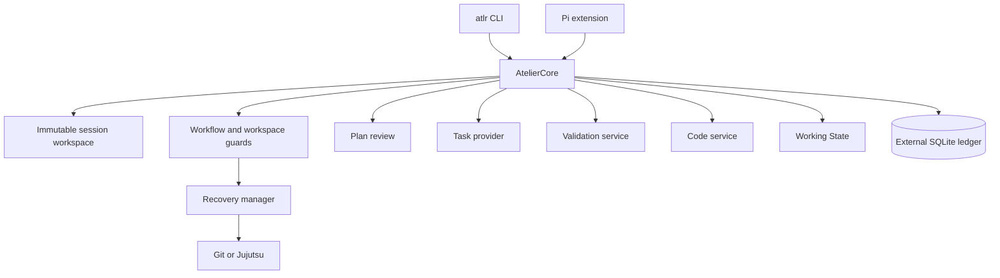

# Architecture Overview

Atelier is a local-first workflow control plane for an Agentic Development Environment. The `atlr`
CLI and Pi extension share the same durable Core for reviewed-plan execution, task reconciliation,
workspace policy, recovery, validation, Working State, and provider-neutral code intelligence.

## Ownership and topology

Atelier coordinates external tools without replacing their native responsibilities:

- editors own interactive text editing;
- Jujutsu is the primary repository provider and Git is the compatibility provider;
- Beads or another task provider owns task storage and dependencies;
- codesearch and Octocode own indexing and retrieval implementation;
- configured commands own validation behavior;
- Seatbelt or Bubblewrap provides the available OS shell boundary.



## Authority boundaries

The session workspace is captured from the canonical startup directory or one explicit workspace
argument and does not expand implicitly. Workflow state, approvals, task identity, reviewed source
paths, named validations, and closure readiness come from durable state and reviewed plan data.
Conversation text and model compaction are not authorities.

Pi `/trust` controls Pi-owned project resources only. It does not grant Atelier filesystem authority.
The workspace evaluator separately considers containment, likely secrets, privilege escalation, VCS
state, and exact recoverability. Unknown or unsuitable effects remain conservative.

## Execution and recovery

Plan approval binds the reviewed plan hash, task-provider identity, reconciliation digest, source
snapshots, every approved repository revision, retrieval provenance, and reviewed task constraints.
Approval reconciles and claims the selected task atomically; it does not start an agent turn.

The workflow guard and workspace evaluator remain separate. Effects may be allowed directly,
checkpointed before allowing, requested for one-operation approval, or denied. Recovery checkpoints
preserve staged and unstaged Git state or the native Jujutsu operation boundary, including affected
untracked and ignored paths. Tool evidence records the decision, task identity, before and after
snapshots, attributable path changes, and bounded outcomes.

Validation runs as argument arrays with bounded, redacted output and abort-aware process handling.
Task closure requires current required validations, an exact final-diff review, a local commit or
finalized change, and the configured repository cleanliness state.

## Working State and code intelligence

Working State is deterministic reconstruction from the immutable workspace, workflow mode, reviewed
plan, reconciliation and execution state, task dependencies, recovery checkpoints, validation and
mutation evidence, repository snapshots, findings, and bounded code evidence. Pi receives this state
at agent start and before compaction.

Atelier owns provider contracts, capability negotiation, budgets, normalized references, provenance,
revision bindings, deduplication, reuse, and invalidation. Providers own indexes:

```text
CodeService
  ├── codesearch (default)
  ├── Octocode (optional)
  ├── mock (tests)
  └── disabled
```

Provider-first retrieval is advisory rather than an authorization gate. Evidence is isolated by
provider, workspace, repository scope, source revision, and provider index revision.

## Session lifecycle

Each Pi session owns its Core, repository root, plan-review state, retrieval session, and index
coordinator. Shutdown and session replacement dispose asynchronous providers before closing SQLite.
The external ledger retains workflow, approval, recovery, validation, retrieval, and presentation
evidence while user-owned runtime files remain outside the repository.
